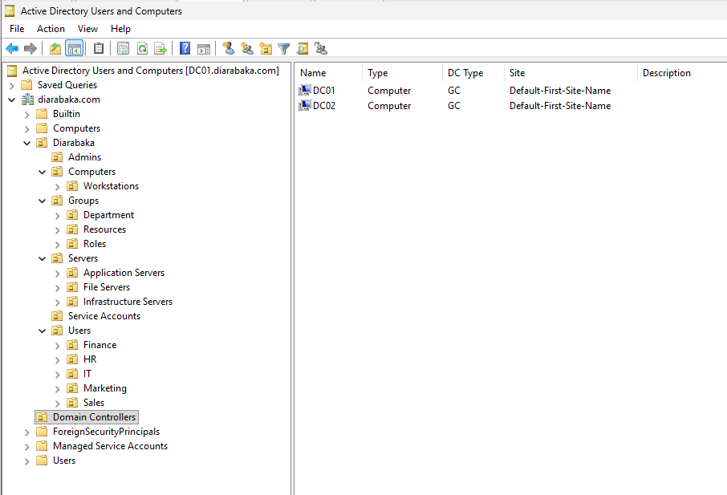
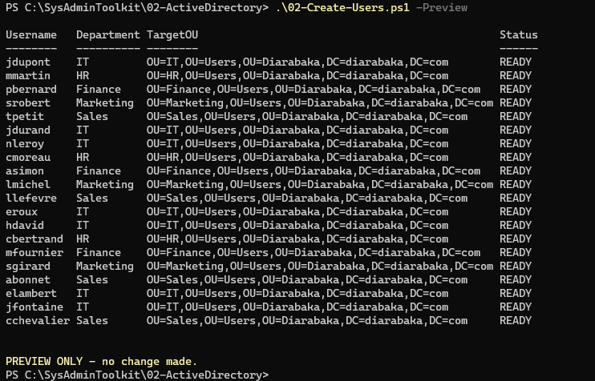
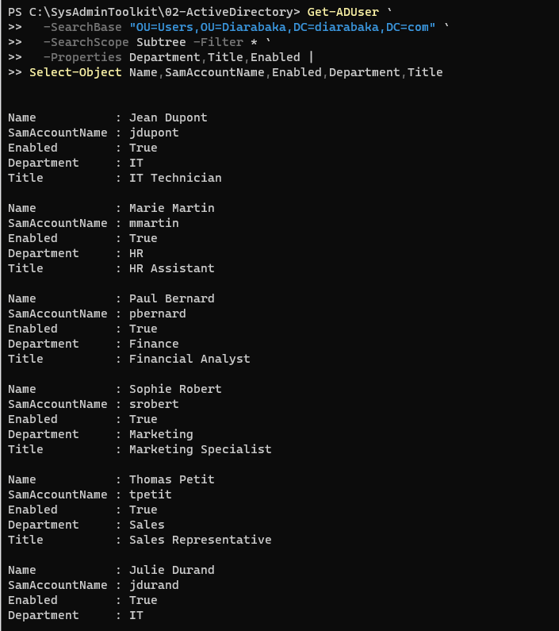
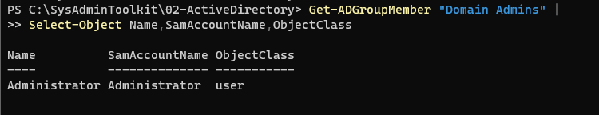
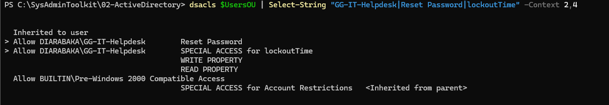
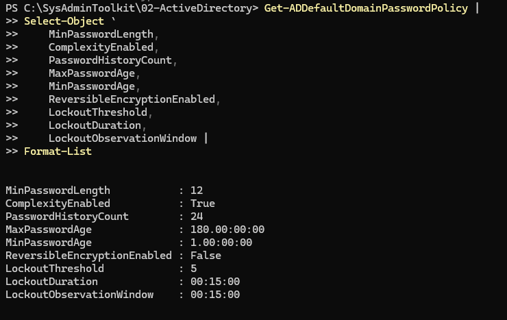
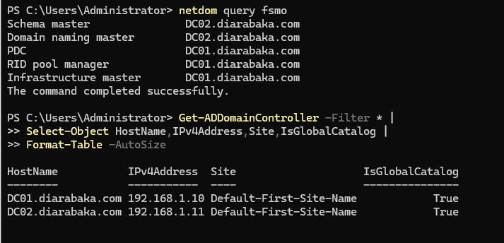
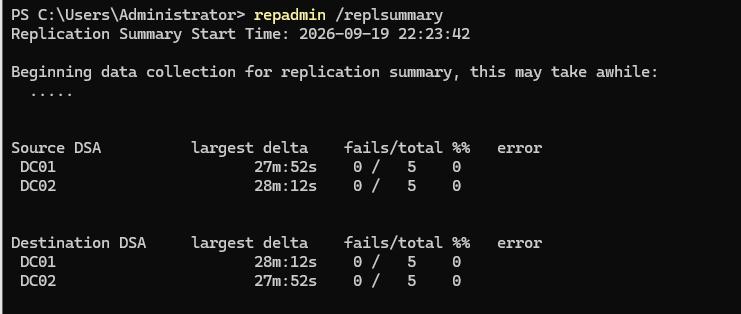
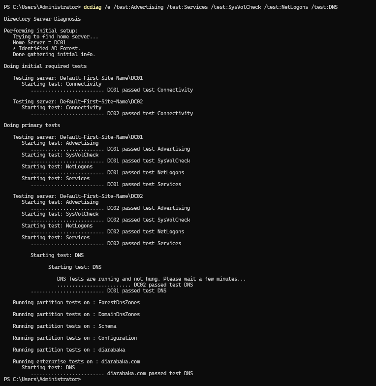
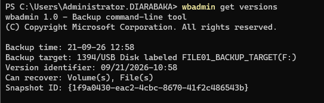

# ACTIVE DIRECTORY

## Architecture



---

## PowerShell Automation

```text
C:\SysAdminToolkit\02-ActiveDirectory
├── Data\Users.csv
├── Logs\
├── Reports\
├── 01-Create-AD-OUs.ps1
├── 02-Create-Users.ps1
├── 03-Create-Groups.ps1
├── 04-Assign-Users-To-Groups.ps1
└── 05-Helpdesk-UserManagement.ps1
```

- 20 users provisioned from CSV
- automatic OU placement
- security groups
- department membership
- account lifecycle
- Helpdesk operations



---

## Users and Groups





---

## Secure Administration

```text
Standard User
      ≠
Administrative Account
```

Helpdesk operations:

```powershell
.\05-Helpdesk-UserManagement.ps1 -Action ResetPassword -Username jdupont
.\05-Helpdesk-UserManagement.ps1 -Action Unlock -Username jdupont
.\05-Helpdesk-UserManagement.ps1 -Action Disable -Username jdupont
.\05-Helpdesk-UserManagement.ps1 -Action Enable -Username jdupont
```



---

## Password & Lockout Policy

| Control               | Value      |
| --------------------- | ---------- |
| Minimum length        | 12         |
| History               | 24         |
| Complexity            | Enabled    |
| Maximum age           | 180 days   |
| Minimum age           | 1 day      |
| Lockout threshold     | 5 attempts |
| Lockout duration      | 15 minutes |
| Reversible encryption | Disabled   |



---

## FSMO / Global Catalog

```text
DC01
├── PDC Emulator
├── RID Master
└── Infrastructure Master

DC02
├── Schema Master
└── Domain Naming Master

Global Catalog
├── DC01
└── DC02
```



---

## Replication



```text
Replication failures : 0
```

---

## Health Check



```text
DC01        : PASS
DC02        : PASS
Advertising : PASS
Services    : PASS
SysVolCheck : PASS
NetLogons   : PASS
DNS         : PASS
```

---

## Backup / Restore

- System State backup
- separate backup target
- restore tested



### Validation

| Control             | Status |
| ------------------- | :----: |
| OU Structure        |   ✅   |
| 20 Users            |   ✅   |
| Groups              |   ✅   |
| Helpdesk Delegation |   ✅   |
| Password Policy     |   ✅   |
| FSMO / GC           |   ✅   |
| Replication         |   ✅   |
| DCDIAG              |   ✅   |
| Backup / Restore    |   ✅   |

**Status:** ✅ `VALIDATED`
