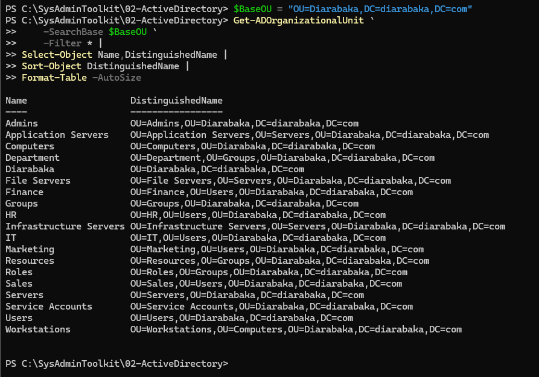
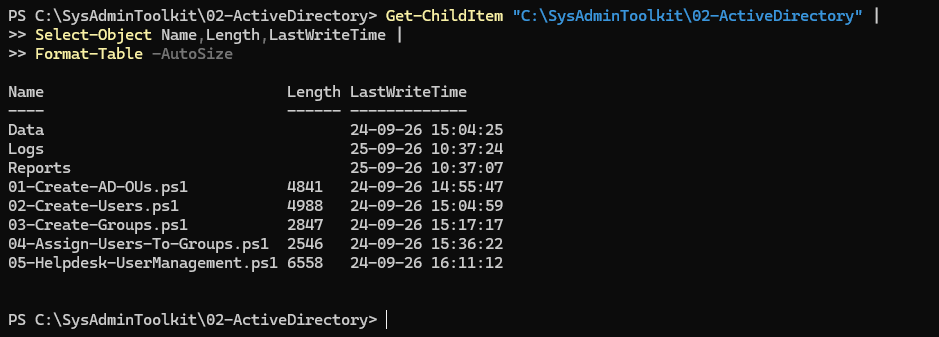
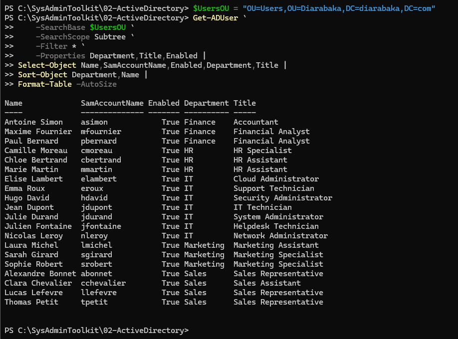
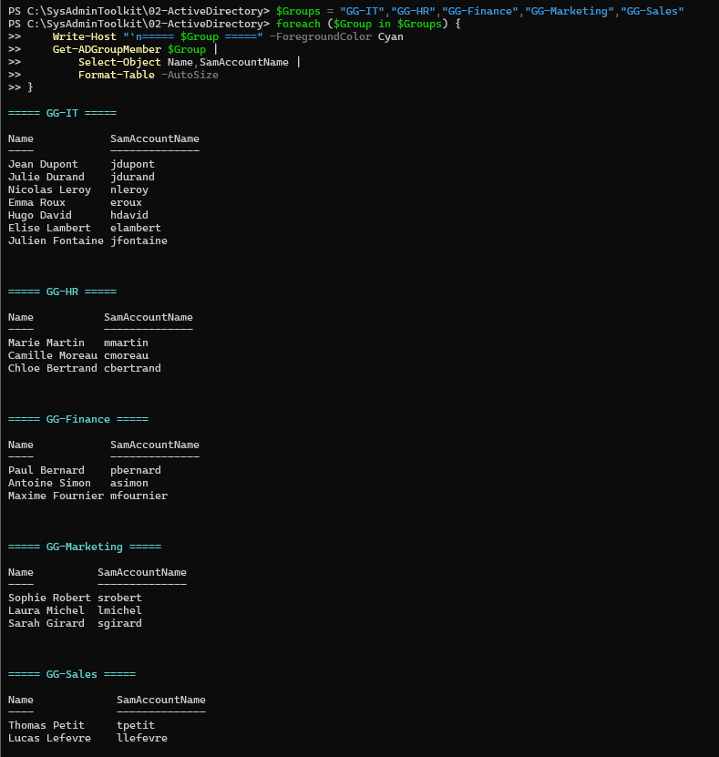
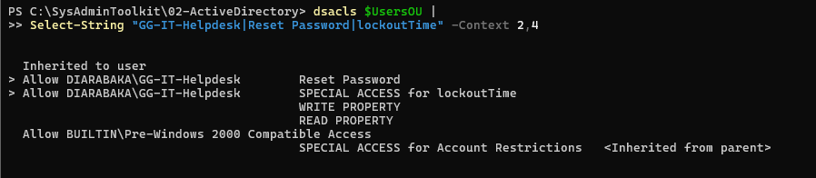
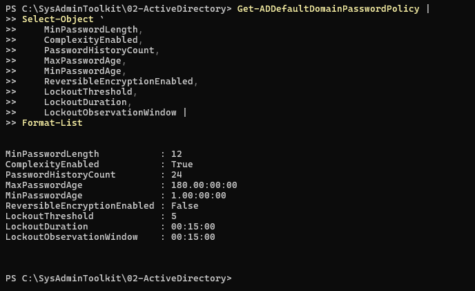
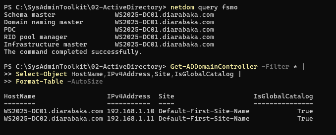
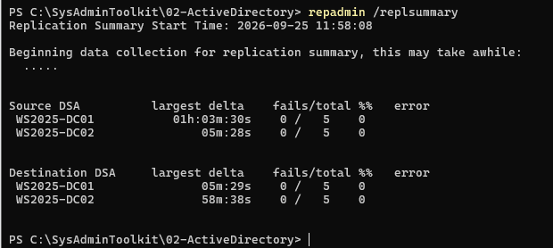
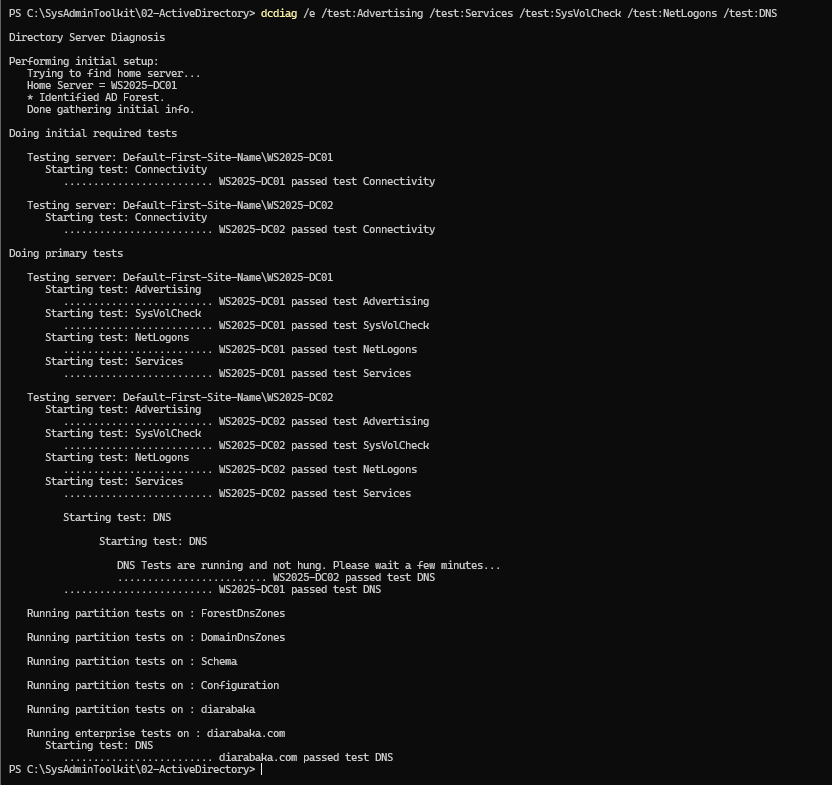

# ACTIVE DIRECTORY

## Architecture

Active Directory domain infrastructure for `diarabaka.com` with two Windows Server 2025 Domain Controllers.

```text
diarabaka.com
│
├── WS2025-DC01
│   └── 192.168.1.10
│
├── WS2025-DC02
│   └── 192.168.1.11
│
└── OU=Diarabaka
    ├── Users
    ├── Groups
    ├── Computers
    ├── Servers
    ├── Admins
    └── Service Accounts
```



---

## PowerShell Automation

```text
C:\SysAdminToolkit\02-ActiveDirectory
├── Data\Users.csv
├── Logs\
├── Reports\
├── 01-Create-AD-OUs.ps1
├── 02-Create-Users.ps1
├── 03-Create-Groups.ps1
├── 04-Assign-Users-To-Groups.ps1
└── 05-Helpdesk-UserManagement.ps1
```

Automation includes:

- OU provisioning
- Bulk user creation from CSV
- Security group creation
- Department group membership
- User account administration



---

## Users

Active Directory users are organized by department and managed through PowerShell automation.



---

## Groups

Department security groups are used to organize access and administrative responsibilities.

```text
GG-IT
GG-HR
GG-Finance
GG-Marketing
GG-Sales
```



---

## Helpdesk Delegation

Helpdesk administration is based on delegated permissions instead of unrestricted Domain Admin access.

Typical operations:

```powershell
.\05-Helpdesk-UserManagement.ps1 -Action ResetPassword -Username jdupont
.\05-Helpdesk-UserManagement.ps1 -Action Unlock -Username jdupont
.\05-Helpdesk-UserManagement.ps1 -Action Disable -Username jdupont
.\05-Helpdesk-UserManagement.ps1 -Action Enable -Username jdupont
```

```text
Helpdesk Account
      ↓
Delegated AD Permissions
      ↓
User Management
```



---

## Password & Account Lockout Policy

| Control                 | Value      |
| ----------------------- | ---------- |
| Minimum password length | 12         |
| Password history        | 24         |
| Complexity              | Enabled    |
| Maximum password age    | 180 days   |
| Minimum password age    | 1 day      |
| Lockout threshold       | 5 attempts |
| Lockout duration        | 15 minutes |
| Reversible encryption   | Disabled   |



---

## FSMO Roles & Global Catalog

All five FSMO roles are currently hosted on `WS2025-DC01`.

```text
WS2025-DC01
├── Schema Master
├── Domain Naming Master
├── PDC Emulator
├── RID Master
└── Infrastructure Master
```

Both Domain Controllers are configured as Global Catalog servers.

```text
Global Catalog
├── WS2025-DC01 ✅
└── WS2025-DC02 ✅
```



---

## Active Directory Replication

Replication between both Domain Controllers was verified with `repadmin`.

```text
WS2025-DC01 → 0 failures
WS2025-DC02 → 0 failures
```



---

## Domain Controller Health

Domain Controller health checks cover core Active Directory services.

```text
Advertising
Services
SysVolCheck
NetLogons
DNS
```

Validation command:

```powershell
dcdiag /e /test:Advertising /test:Services /test:SysVolCheck /test:NetLogons /test:DNS
```



---

## Key Skills

```text
Active Directory Domain Services
Windows Server 2025
Organizational Units
PowerShell Automation
Bulk User Provisioning
Security Groups
Delegated Administration
Password Policies
Account Lockout Policies
FSMO Roles
Global Catalog
AD Replication
DCDIAG
REPADMIN
```

---

## Infrastructure

| Component       | Configuration       |
| --------------- | ------------------- |
| Domain          | `diarabaka.com`     |
| Primary DC      | `WS2025-DC01`       |
| Primary DC IP   | `192.168.1.10`      |
| Secondary DC    | `WS2025-DC02`       |
| Secondary DC IP | `192.168.1.11`      |
| Platform        | VMware              |
| OS              | Windows Server 2025 |
