# DNS

## Architecture

```text
                    WIN11
                      │
                   DNS
                      │
             ┌────────┴────────┐
             ▼                 ▼
           DC01              DC02
        AD DS + DNS       AD DS + DNS
             │                 │
             └────────┬────────┘
                      │
                AD Replication
                      │
      ┌───────────────┼────────────────┐
      ▼               ▼                ▼
diarabaka.com   _msdcs.diarabaka.com   Reverse DNS
```

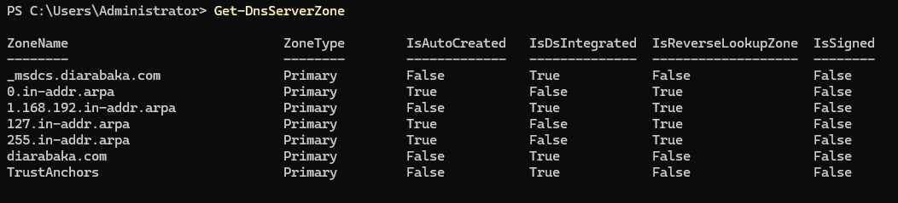

---

## DNS Zones

```text
diarabaka.com
_msdcs.diarabaka.com
1.168.192.in-addr.arpa
```

```powershell
Get-DnsServerZone |
Select-Object ZoneName,ZoneType,IsDsIntegrated,DynamicUpdate,ReplicationScope
```

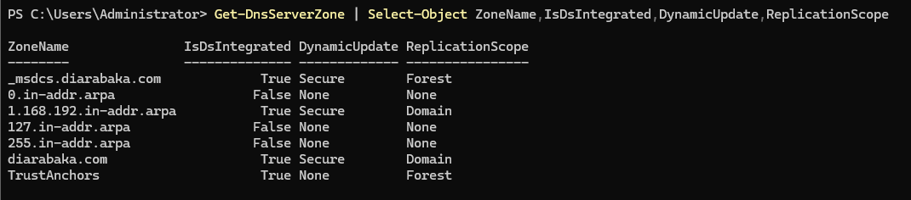

---

## A / PTR Records

```powershell
Resolve-DnsName dc01.diarabaka.com
```

```text
Hostname → A → IP
IP → PTR → Hostname
```

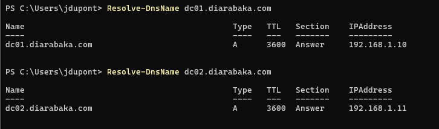

---

## Active Directory SRV

```powershell
Resolve-DnsName "_ldap._tcp.dc._msdcs.diarabaka.com" -Type SRV
Resolve-DnsName "_kerberos._tcp.diarabaka.com" -Type SRV
Resolve-DnsName "_ldap._tcp.gc._msdcs.diarabaka.com" -Type SRV
```

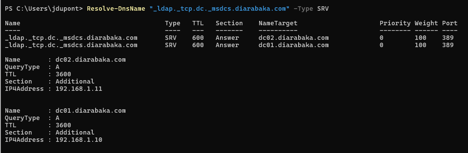

---

## WIN11 DNS

```powershell
Get-DnsClientServerAddress -AddressFamily IPv4
```

```text
WIN11
├── DC01
└── DC02
```

No public DNS configured directly on the domain client.

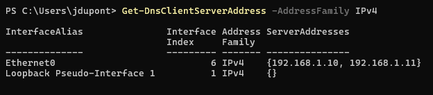

---

## External Resolution

```powershell
Resolve-DnsName www.microsoft.com
```

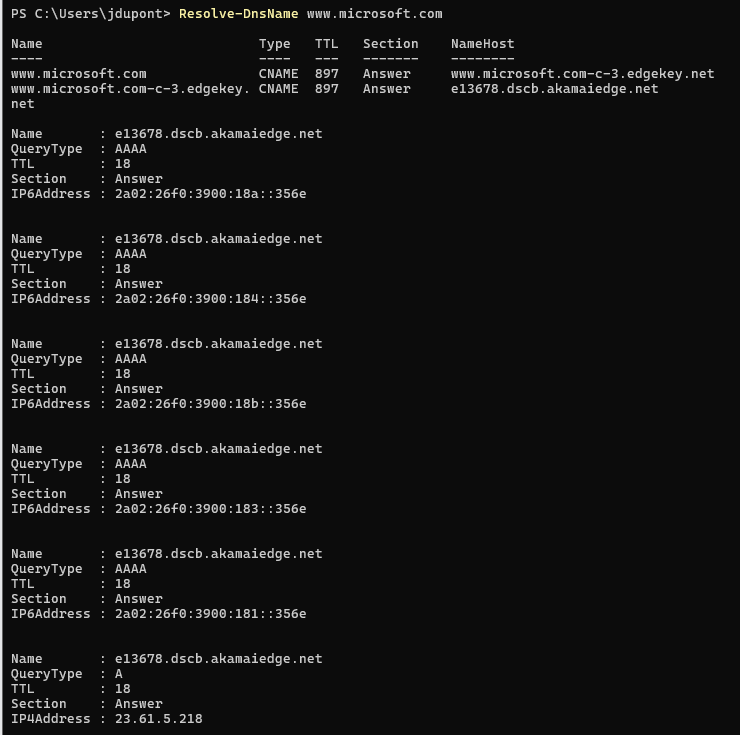

---

## DC Locator

```powershell
nltest /dsgetdc:diarabaka.com
```

```text
DNS → SRV → DC Locator → Domain Controller
```

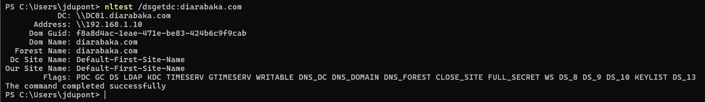

---

## Kerberos

```powershell
klist
```

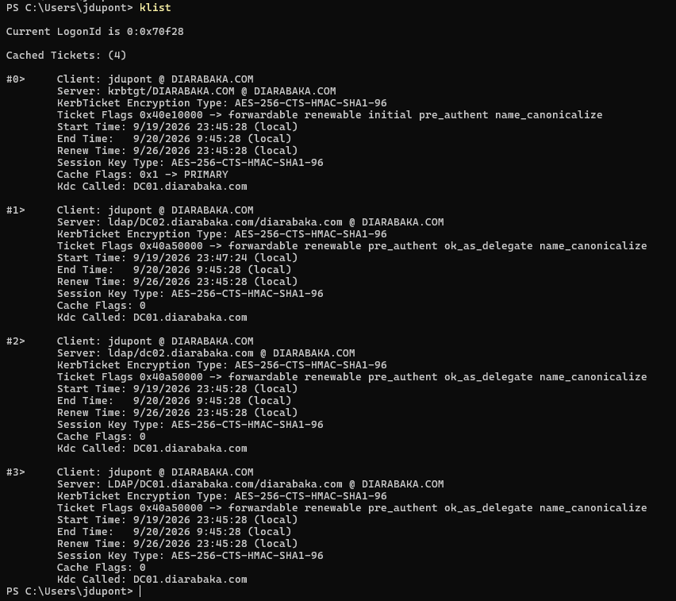

---

## DNS Health

```powershell
dcdiag /test:dns
```

```text
DC01 : PASS
DC02 : PASS
DNS  : PASS
```

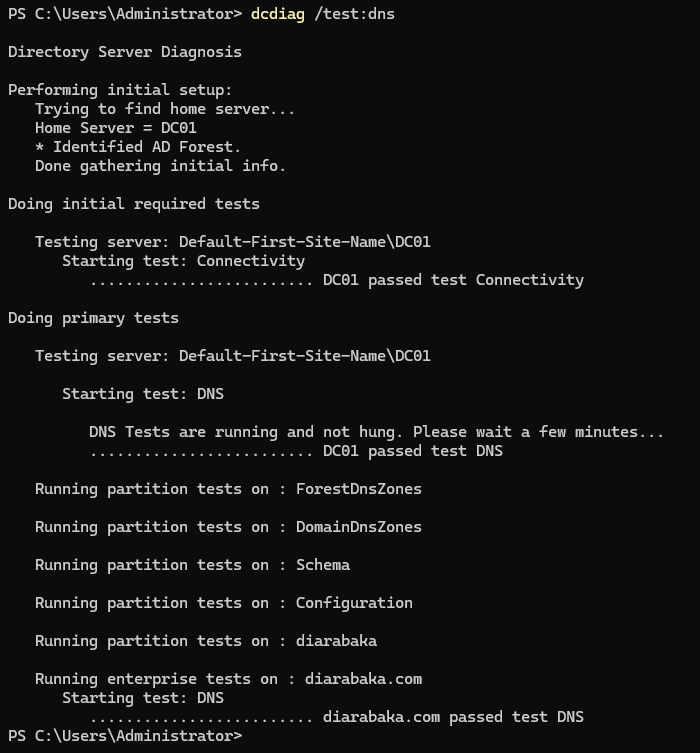

---

## DNS Logs

```powershell
Get-WinEvent -LogName "DNS Server" -MaxEvents 20
```

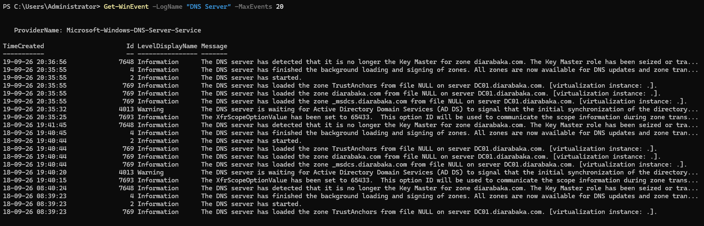

---

## Redundancy / Failure Test

```text
DC01 unavailable
       ↓
DC02 available
       ↓
DNS resolution continues
       ↓
DC Locator remains functional
```

```powershell
Resolve-DnsName dc01.diarabaka.com -Server 192.168.1.11
```

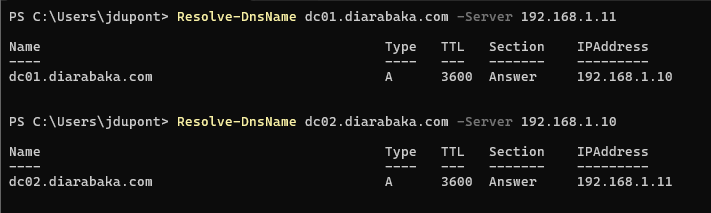

---

## Final Validation

```powershell
repadmin /replsummary
```

```text
Replication failures : 0
```

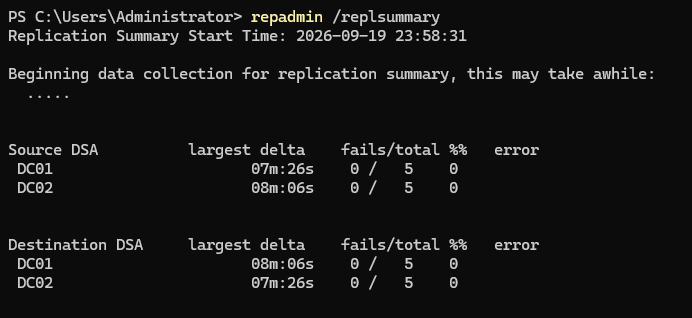

### Validation

| Control                 | Status |
| ----------------------- | :----: |
| AD-Integrated DNS       |   ✅   |
| Forward / Reverse Zones |   ✅   |
| A / PTR                 |   ✅   |
| LDAP / Kerberos SRV     |   ✅   |
| WIN11 DNS               |   ✅   |
| External Resolution     |   ✅   |
| DC Locator              |   ✅   |
| DCDIAG                  |   ✅   |
| DNS Redundancy          |   ✅   |
| Failure / Recovery      |   ✅   |

**Status:** ✅ `VALIDATED`
