# DNS

## DNS Role & Service

DNS is hosted on both Windows Server 2025 Domain Controllers.

```text
WS2025-DC01
├── AD DS
└── DNS

WS2025-DC02
├── AD DS
└── DNS
```

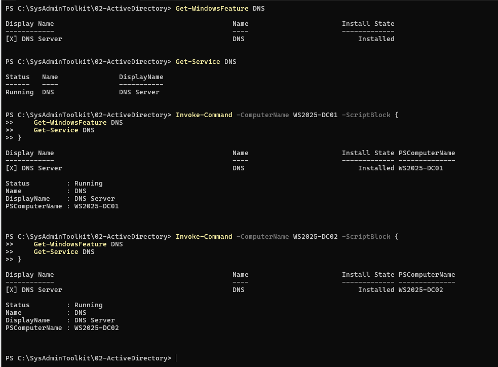

---

## DNS Zones

Active Directory-integrated DNS provides forward and reverse name resolution.

```text
diarabaka.com
_msdcs.diarabaka.com
1.168.192.in-addr.arpa
```

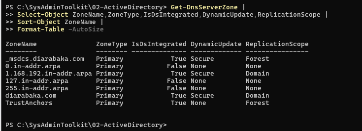

---

## A & PTR Records

Forward and reverse DNS records were verified for both Domain Controllers.

```text
WS2025-DC01.diarabaka.com
        ↓
192.168.1.10

WS2025-DC02.diarabaka.com
        ↓
192.168.1.11
```

```text
Hostname → A → IPv4
IPv4     → PTR → Hostname
```

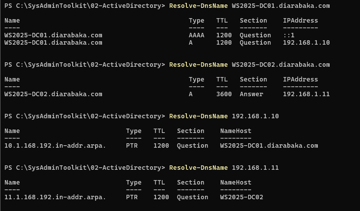

---

## Active Directory SRV Records

Active Directory service records were verified for LDAP, Kerberos and Global Catalog discovery.

```powershell
Resolve-DnsName "_ldap._tcp.dc._msdcs.diarabaka.com" -Type SRV
Resolve-DnsName "_kerberos._tcp.diarabaka.com" -Type SRV
Resolve-DnsName "_ldap._tcp.gc._msdcs.diarabaka.com" -Type SRV
```

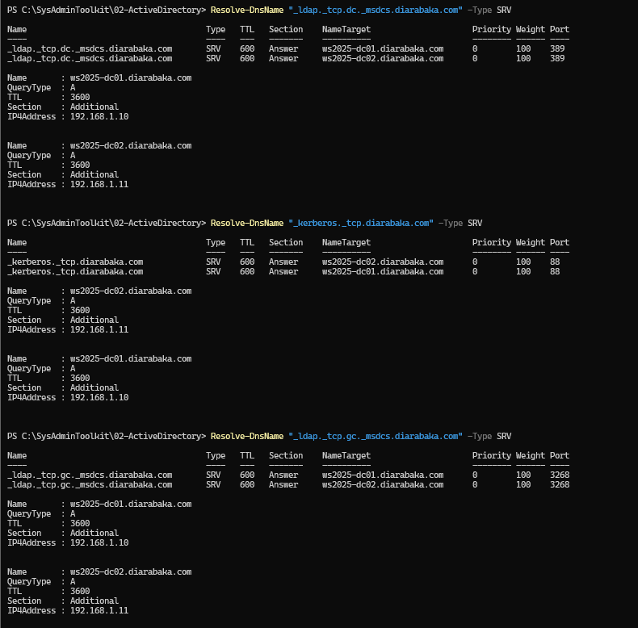

---

## WIN11 DNS Configuration

The Windows 11 domain client uses only the internal Active Directory DNS servers.

```text
WIN11
 │
 ├── DNS1 → 192.168.1.10
 │           WS2025-DC01
 │
 └── DNS2 → 192.168.1.11
             WS2025-DC02
```

No public DNS server is configured directly on the domain client.

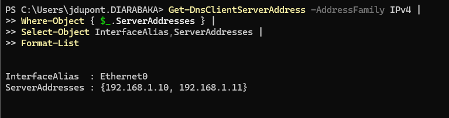

---

## Domain Controller Locator

DNS SRV records allow the domain client to locate an available Domain Controller.

```text
WIN11
  ↓
DNS
  ↓
SRV Records
  ↓
DC Locator
  ↓
Domain Controller
```

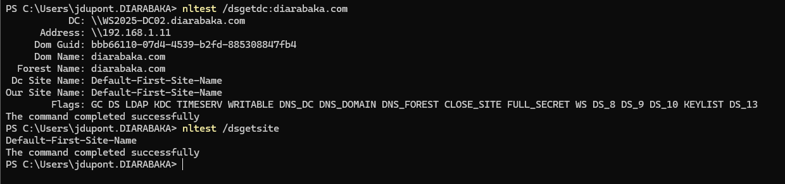

---

## External DNS Resolution

External name resolution was tested while keeping the domain client configured with internal DNS servers.

```text
WIN11
  ↓
Internal DNS
  ↓
External Resolution
```

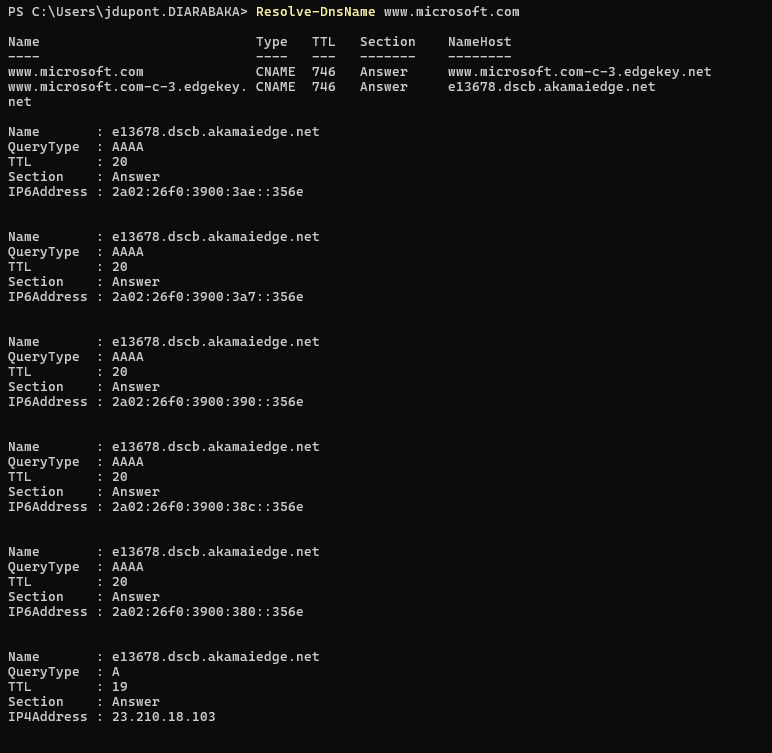

---

## DNS Health

DNS health was checked with Microsoft Active Directory diagnostic tools.

```powershell
dcdiag /e /test:dns
```

```text
DNS diagnostic checks
        ↓
Domain Controllers
        ↓
Active Directory DNS
```

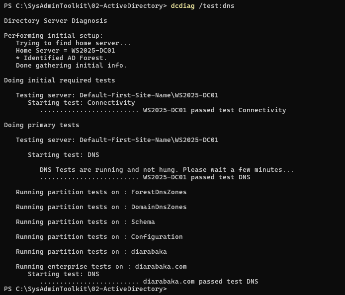

---

## Active Directory Replication

DNS-integrated Active Directory replication was verified between both Domain Controllers.

```text
WS2025-DC01 ↔ WS2025-DC02

Replication failures : 0
```

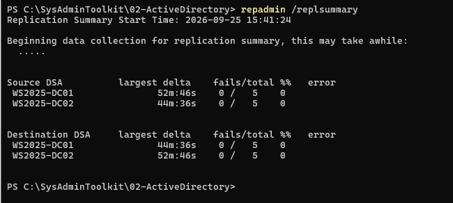

---

## DNS Redundancy Test

### Controlled Failure

The DNS service on `WS2025-DC01` was stopped as part of the redundancy test.

```text
WS2025-DC01
     ↓
DNS Service
     ↓
Stopped
```

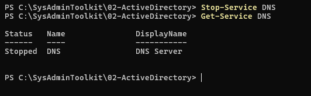

---

### DNS Failover to WS2025-DC02

During the controlled failure, `WS2025-DC02` remained available to provide DNS services.

```text
WS2025-DC01 DNS
      ↓
   Unavailable

WS2025-DC02 DNS
      ↓
   Available
      ↓
DNS Resolution
      ↓
DC Locator
```

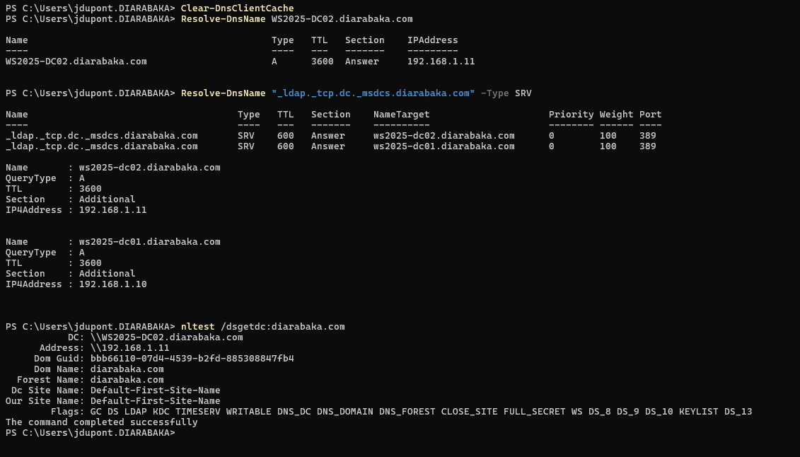

---

## Key Skills

```text
Windows Server DNS
Active Directory Integrated DNS
Forward Lookup Zones
Reverse Lookup Zones
A Records
PTR Records
SRV Records
LDAP
Kerberos
Global Catalog
DC Locator
DNS Client Configuration
DCDIAG
REPADMIN
DNS Redundancy
Controlled Failure Testing
PowerShell
```

---

## Infrastructure

| Component       | Configuration    |
| --------------- | ---------------- |
| Domain          | `diarabaka.com`  |
| DNS Server 1    | `WS2025-DC01`    |
| DNS Server 1 IP | `192.168.1.10`   |
| DNS Server 2    | `WS2025-DC02`    |
| DNS Server 2 IP | `192.168.1.11`   |
| Client          | `WIN11`          |
| Network         | `192.168.1.0/24` |
| Platform        | VMware           |
