# DHCP

## Architecture

```text
                 192.168.1.0/24
                       │
               Gateway 192.168.1.1
                       │
          ┌────────────┴────────────┐
          ▼                         ▼
        DC01                      DC02
   192.168.1.10              192.168.1.11
   AD + DNS + DHCP           AD + DNS + DHCP
          │                         │
          └────────────┬────────────┘
                       │
              DHCP Failover 50/50
                       │
              192.168.1.100-200
                       │
                     WIN11
```

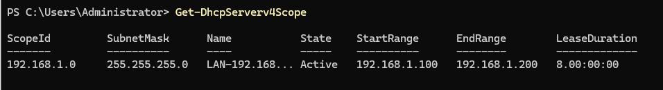

---

## Role / Authorization

```powershell
Get-WindowsFeature DHCP
Get-Service DHCPServer
Get-DhcpServerInDC
Get-DhcpServerv4Binding
```

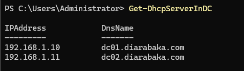

---

## IPv4 Scope

| Parameter | Value            |
| --------- | ---------------- |
| Scope     | `192.168.1.0/24` |
| Start     | `192.168.1.100`  |
| End       | `192.168.1.200`  |
| Mask      | `255.255.255.0`  |

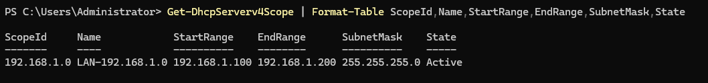

---

## DHCP Options

| Option       | Value                          |
| ------------ | ------------------------------ |
| `003` Router | `192.168.1.1`                  |
| `006` DNS    | `192.168.1.10`, `192.168.1.11` |
| `015` Domain | `diarabaka.com`                |

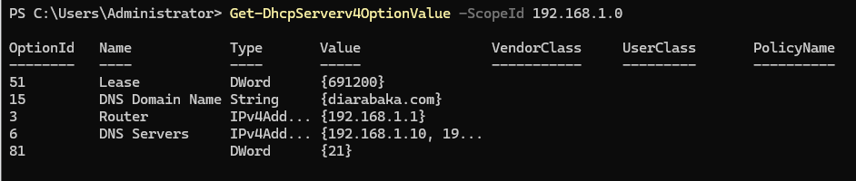

---

## Lease / Reservation

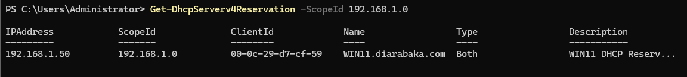

---

## WIN11 Configuration

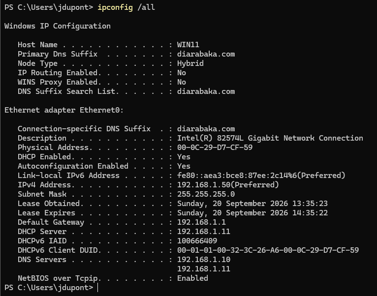

```text
DHCP       : Enabled
Gateway    : 192.168.1.1
DNS 1      : 192.168.1.10
DNS 2      : 192.168.1.11
DNS suffix : diarabaka.com
```

---

## Dynamic DNS

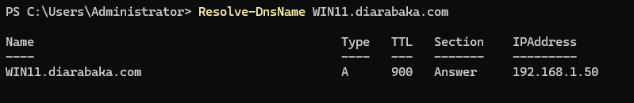

```text
WIN11
├── A
└── PTR
```

---

## DHCP Failover

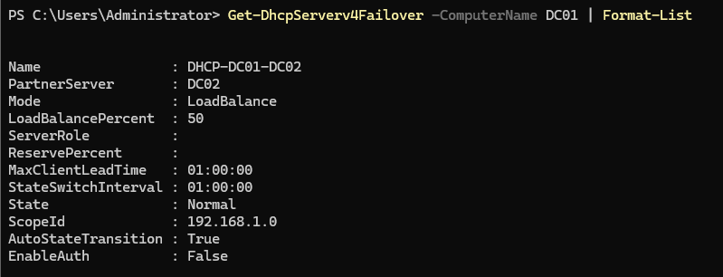

| Parameter             | Value            |
| --------------------- | ---------------- |
| Relationship          | `DHCP-DC01-DC02` |
| Mode                  | Load Balance     |
| Distribution          | `50/50`          |
| State                 | `Normal`         |
| Auto State Transition | Enabled          |
| State Switch Interval | `01:00:00`       |
| MCLT                  | Configured       |

---

## Synchronization

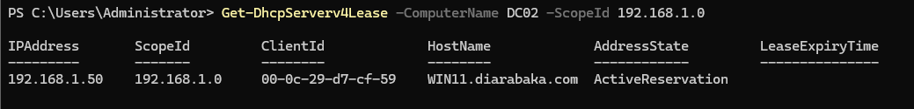

---

## Failure Test

```text
DC01 unavailable
       ↓
DC02 available
       ↓
WIN11 renews lease
       ↓
DHCP remains operational
```

```powershell
ipconfig /renew
```

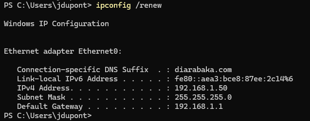

---

## Recovery

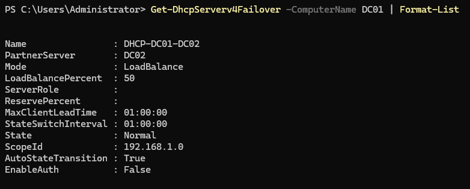

```text
State : Normal
```

---

## Final Validation

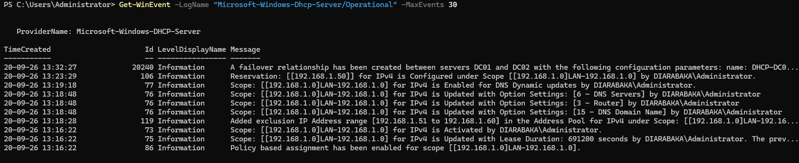

### Validation

| Control          | Status |
| ---------------- | :----: |
| DHCP Roles       |   ✅   |
| AD Authorization |   ✅   |
| Scope            |   ✅   |
| Options          |   ✅   |
| Reservation      |   ✅   |
| Dynamic DNS      |   ✅   |
| Failover 50/50   |   ✅   |
| Synchronization  |   ✅   |
| Failure Test     |   ✅   |
| Recovery         |   ✅   |

**Status:** ✅ `VALIDATED`
