# DHCP

## Architecture

```text
                 192.168.1.0/24
                       │
               Gateway 192.168.1.1
                       │
          ┌────────────┴────────────┐
          ▼                         ▼
   WS2025-DC01                WS2025-DC02
   192.168.1.10               192.168.1.11
   AD + DNS + DHCP            AD + DNS + DHCP
          │                         │
          └────────────┬────────────┘
                       │
              DHCP Failover 50/50
                       │
              192.168.1.100-200
                       │
                     WIN11
```

---

## 01 - DHCP Role / Services

```powershell
Get-WindowsFeature DHCP
Get-Service DHCPServer
Get-DhcpServerInDC
```

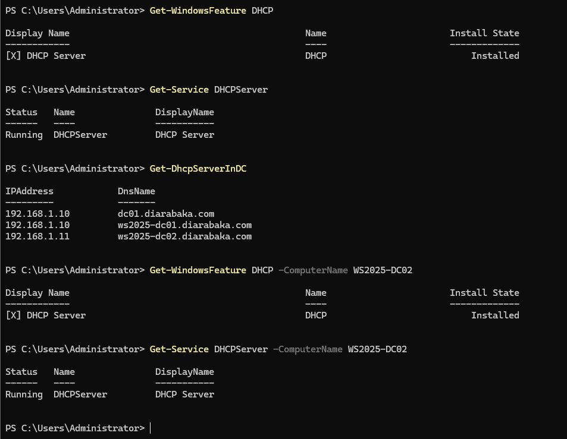

---

## 02 - IPv4 Scope

| Parameter | Value            |
| --------- | ---------------- |
| Scope     | `192.168.1.0/24` |
| Start     | `192.168.1.100`  |
| End       | `192.168.1.200`  |
| Mask      | `255.255.255.0`  |
| State     | `Active`         |

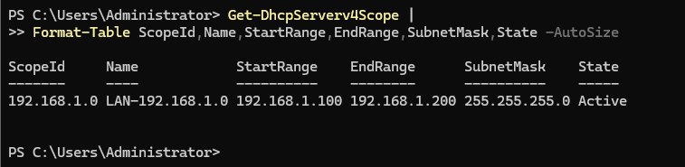

---

## 03 - DHCP Options

| Option            | Value                          |
| ----------------- | ------------------------------ |
| `003` Router      | `192.168.1.1`                  |
| `006` DNS Servers | `192.168.1.10`, `192.168.1.11` |
| `015` DNS Domain  | `diarabaka.com`                |

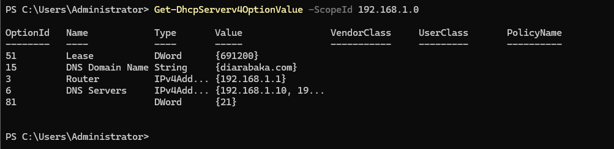

---

## 04 - WIN11 DHCP Configuration

```text
DHCP       : Enabled
Gateway    : 192.168.1.1
DNS 1      : 192.168.1.10
DNS 2      : 192.168.1.11
DNS suffix : diarabaka.com
```

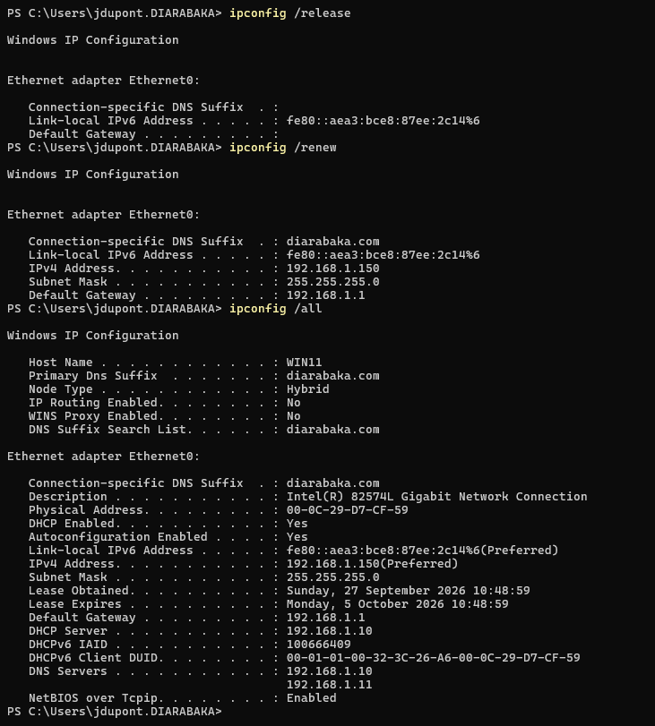

---

## 05 - Lease / Reservation

The WIN11 client lease and DHCP reservation were verified from the DHCP server.

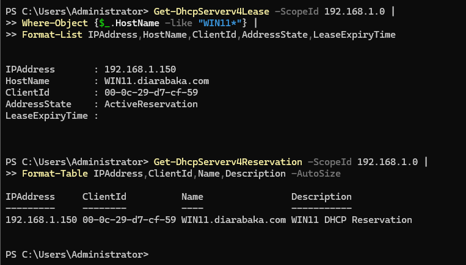

---

## 06 - Dynamic DNS

Dynamic DNS integration was validated for the WIN11 domain client.

```text
WIN11
 ├── A Record
 └── PTR Record
```

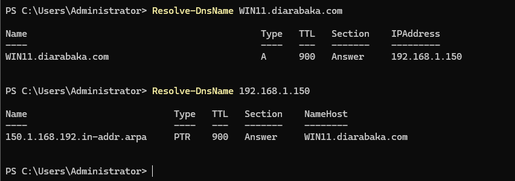

---

## 07 - DHCP Failover

| Parameter             | Value            |
| --------------------- | ---------------- |
| Relationship          | `DHCP-DC01-DC02` |
| Mode                  | `LoadBalance`    |
| Distribution          | `50/50`          |
| State                 | `Normal`         |
| Auto State Transition | Enabled          |
| State Switch Interval | `01:00:00`       |
| MCLT                  | Configured       |

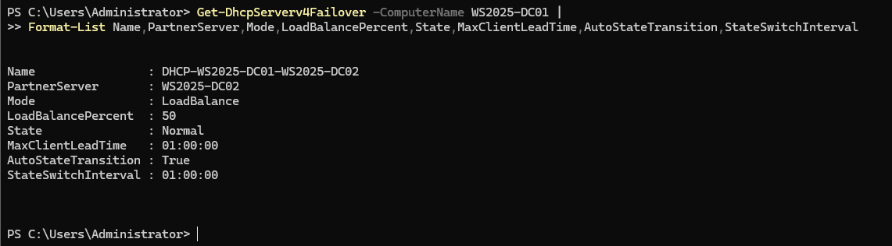

---

## 08 - Controlled Failure Test

### 08A - WS2025-DC01 DHCP Stopped

A controlled failure was performed by stopping only the DHCP service on `WS2025-DC01`.

```text
WS2025-DC01
     │
     ▼
DHCP Service Stopped
```

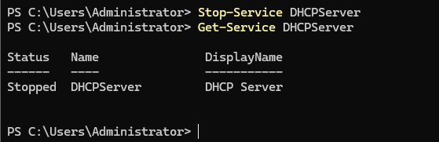

### 08B - Client Continuity Through WS2025-DC02

While DHCP was unavailable on `WS2025-DC01`, WIN11 successfully renewed its network configuration through the remaining DHCP partner.

```text
WS2025-DC01 DHCP unavailable
            ↓
WS2025-DC02 available
            ↓
WIN11 renews DHCP lease
            ↓
DHCP service remains operational
```

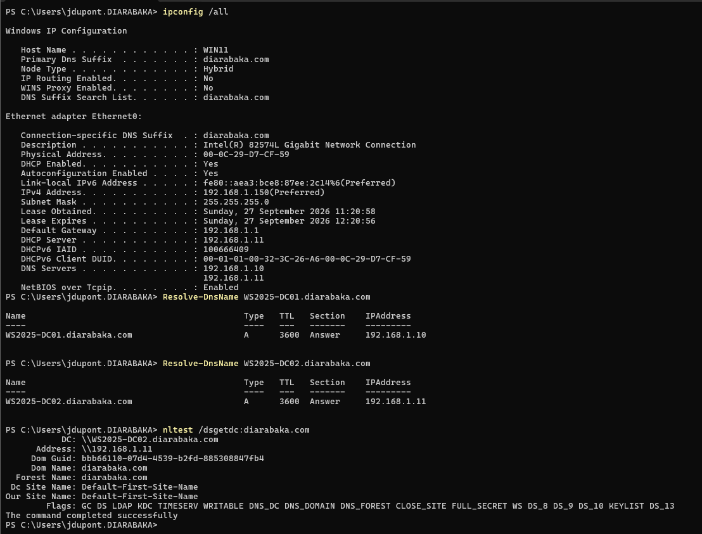

---

## 09 - DHCP Recovery

The DHCP service on `WS2025-DC01` was restored and the failover relationship returned to its normal operational state.

```text
WS2025-DC01 DHCP : Running
Failover State   : Normal
```

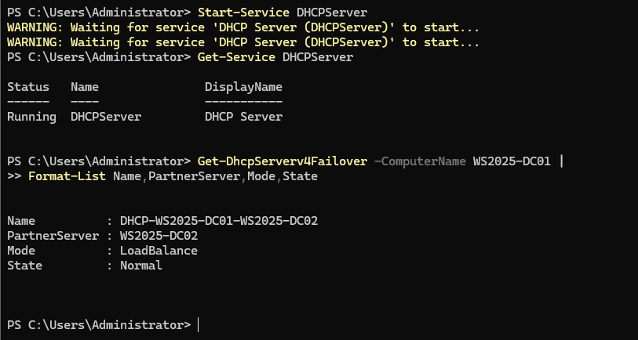

---

## 10 - Final Validation

### 10A - Server-Side Validation

Final validation confirmed:

```text
WS2025-DC01 DHCP : Running
WS2025-DC02 DHCP : Running
Failover Mode    : LoadBalance
Distribution     : 50/50
Failover State   : Normal
Scope            : Active on both partners
```

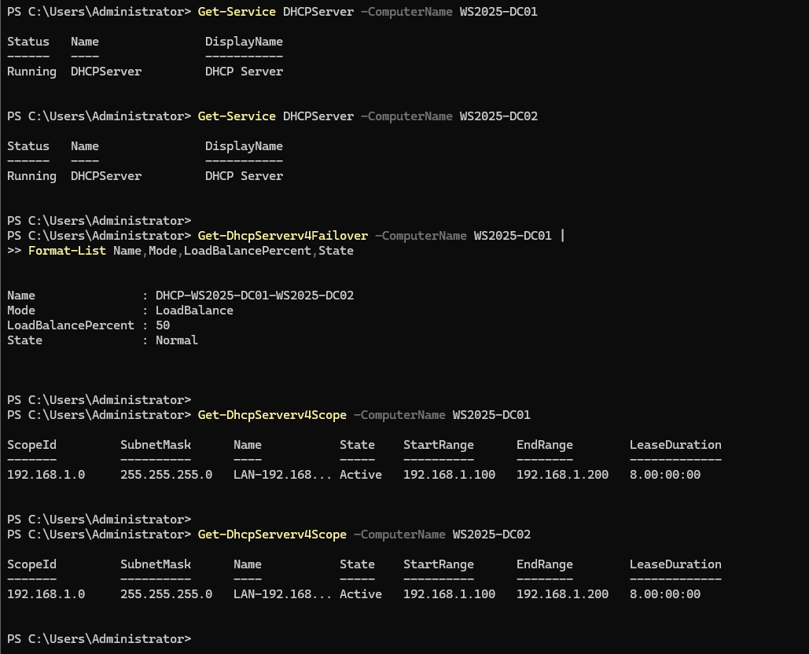

### 10B - Client-Side Validation

WIN11 successfully received its final DHCP configuration after failover and recovery testing.

```text
DHCP       : Enabled
IPv4       : Valid scope address
Gateway    : 192.168.1.1
DNS        : 192.168.1.10 / 192.168.1.11
DNS Suffix : diarabaka.com
```

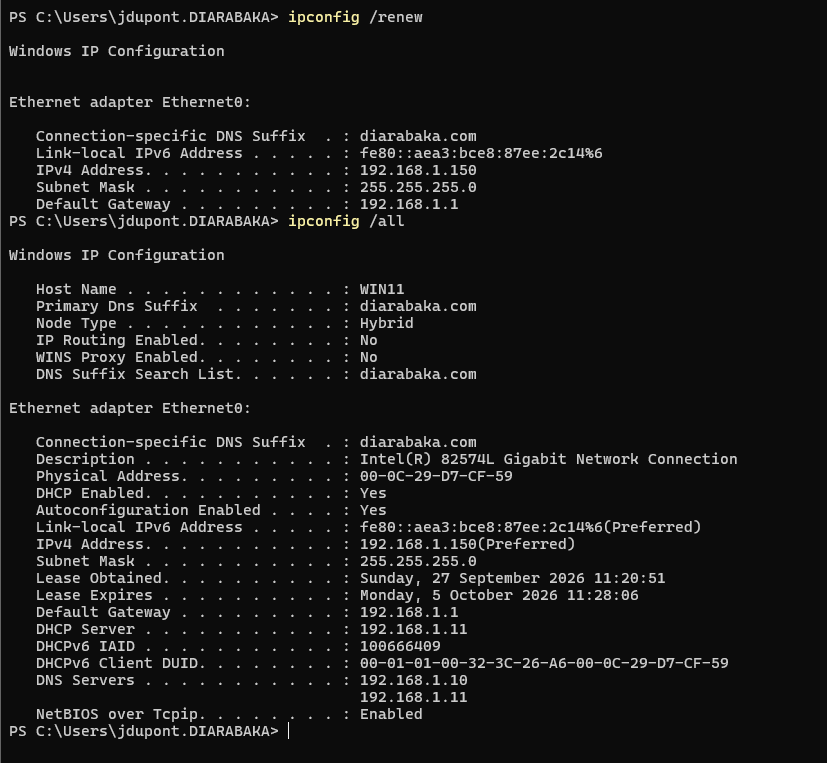

---

## Validation

```text
DHCP Roles
AD Authorization
IPv4 Scope
DHCP Options
WIN11 DHCP
Lease / Reservation
Dynamic DNS
Failover 50/50
Controlled Failure
Client Continuity
Recovery
Final Server Validation
Final Client Validation
```
