# GROUP POLICY

## Architecture

```text
DIARABAKA.COM
│
└── OU=Diarabaka
    └── Computers
        └── Workstations
            └── WIN11
                │
                ├── GPO-WS-Security-Baseline
                ├── GPO-Windows11-BitLocker
                └── GPO-Windows11-LAPS
```

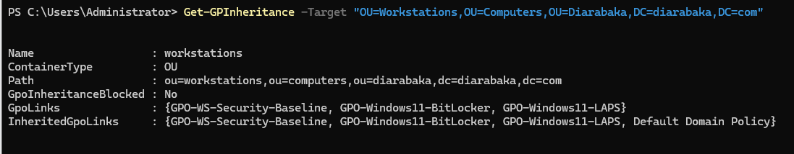

---

## GPO Scope

```powershell
Get-GPO -All |
Select-Object DisplayName,GpoStatus
```

```powershell
Get-GPInheritance `
    -Target "OU=Workstations,OU=Computers,OU=Diarabaka,DC=diarabaka,DC=com"
```

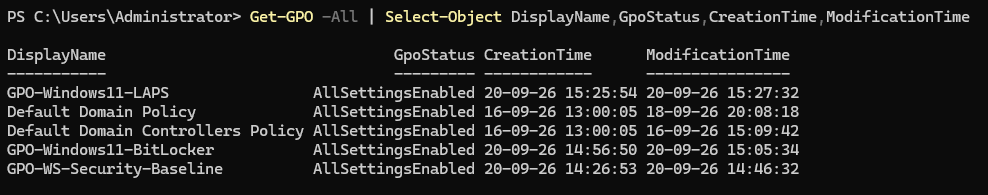

---

## Security Baseline

```text
Windows Firewall
Microsoft Defender
Real-Time Protection
Behavior Monitoring
IOAV
Cloud Protection
Windows Update
```

```powershell
Get-NetFirewallProfile |
Select-Object Name,Enabled,DefaultInboundAction,DefaultOutboundAction
```

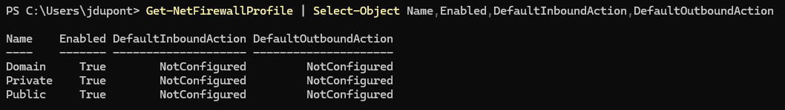

```powershell
Get-MpComputerStatus |
Select-Object AntivirusEnabled,RealTimeProtectionEnabled,BehaviorMonitorEnabled
```

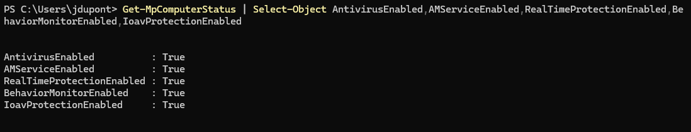

---

## GPO Application

```powershell
gpupdate /force
gpresult /r /scope computer
```

Applied:

```text
GPO-WS-Security-Baseline
GPO-Windows11-BitLocker
GPO-Windows11-LAPS
```

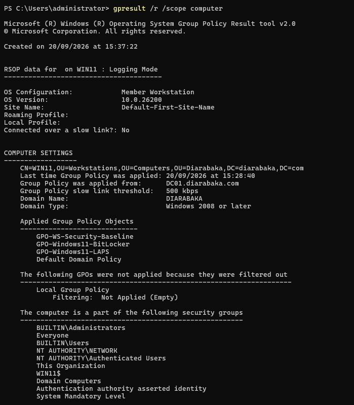

---

## BitLocker

```powershell
Get-Tpm
manage-bde -status C:
manage-bde -protectors -get C:
```

Validated:

```text
TPM               : Ready
C:                 : Encrypted
Protection         : Enabled
TPM Protector      : Present
Recovery Password  : Present
```

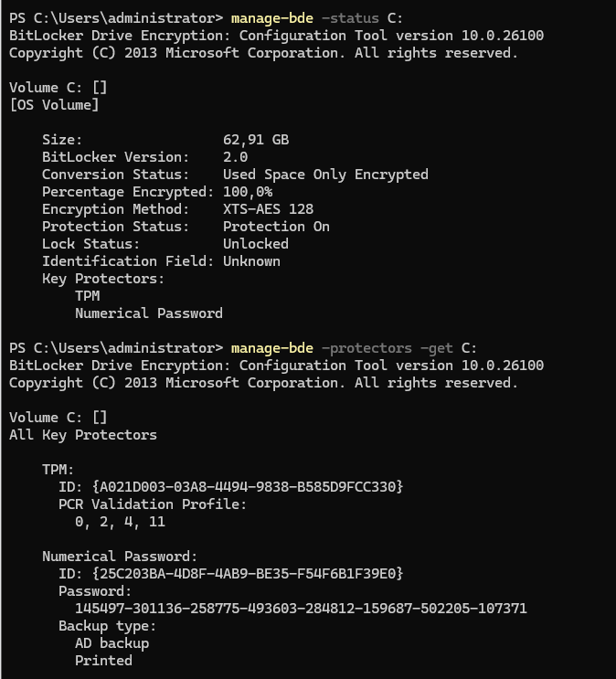

---

## BitLocker Recovery in AD

```powershell
$ComputerDN = (Get-ADComputer WIN11).DistinguishedName

Get-ADObject `
  -Filter 'objectClass -eq "msFVE-RecoveryInformation"' `
  -SearchBase $ComputerDN
```

```text
msFVE-RecoveryInformation
```

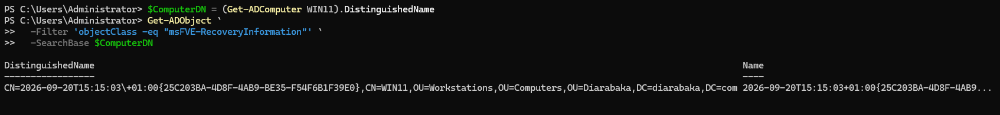

> Recovery key redacted.

---

## Windows LAPS

| Setting                     | Value            |
| --------------------------- | ---------------- |
| Backup                      | Active Directory |
| Password Length             | 14+              |
| Password Age                | 30 days          |
| Encryption                  | Enabled          |
| Post-Authentication Actions | Configured       |

```powershell
Find-LapsADExtendedRights `
    -Identity "OU=Workstations,OU=Computers,OU=Diarabaka,DC=diarabaka,DC=com"
```

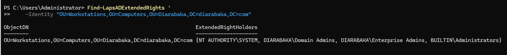

---

## LAPS Processing

```powershell
Invoke-LapsPolicyProcessing
Get-LapsDiagnostics
```

```powershell
Get-WinEvent `
    -LogName "Microsoft-Windows-LAPS/Operational" `
    -MaxEvents 30
```

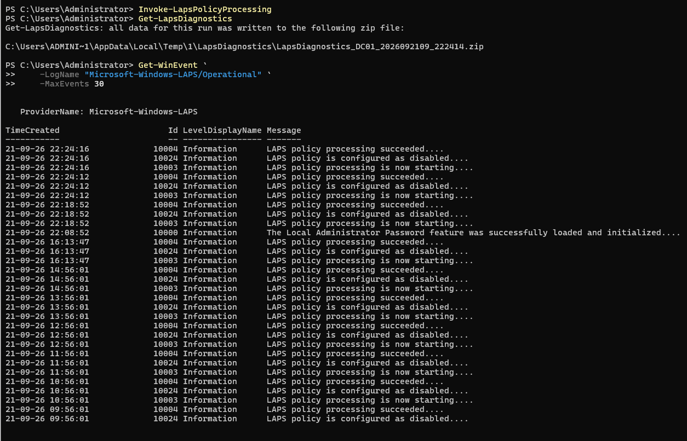

> LAPS password redacted.

---

## SYSVOL / Replication

```powershell
Test-Path "\\diarabaka.com\SYSVOL"
Test-Path "\\diarabaka.com\NETLOGON"
repadmin /replsummary
dcdiag /test:sysvolcheck /test:advertising
```

```text
SYSVOL               : PASS
NETLOGON              : PASS
Replication failures : 0
```

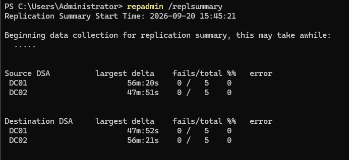

---

## GPO Backup

```powershell
$BackupPath = "C:\SysAdminToolkit\05-GroupPolicy\Backups"

Backup-GPO -All -Path $BackupPath
```

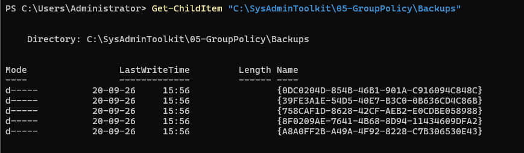

---

## Post-Reboot Validation

```powershell
gpresult /r /scope computer
```

```text
Security Baseline : PASS
Firewall          : PASS
Defender          : PASS
BitLocker         : PASS
Windows LAPS      : PASS
```

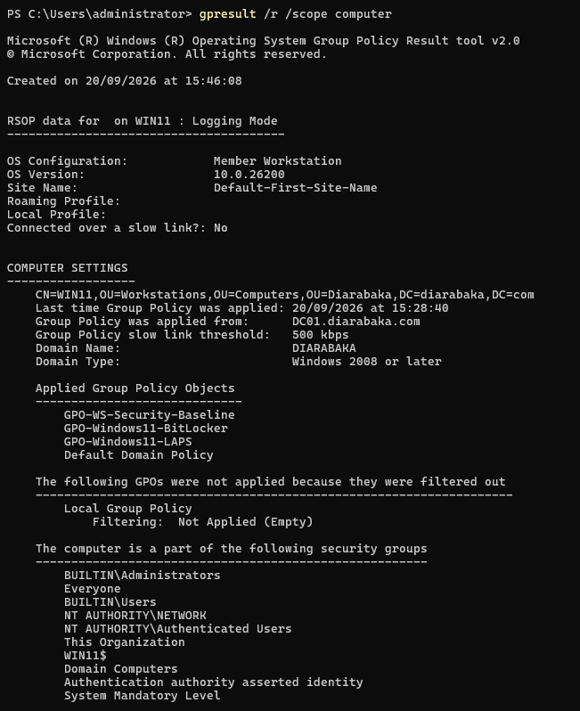

### Validation

| Control             | Status |
| ------------------- | :----: |
| GPO Scope           |   ✅   |
| Security Baseline   |   ✅   |
| Firewall / Defender |   ✅   |
| BitLocker           |   ✅   |
| AD Recovery         |   ✅   |
| Windows LAPS        |   ✅   |
| SYSVOL              |   ✅   |
| Replication         |   ✅   |
| GPO Backup          |   ✅   |
| Post-Reboot         |   ✅   |

**Status:** ✅ `VALIDATED`
