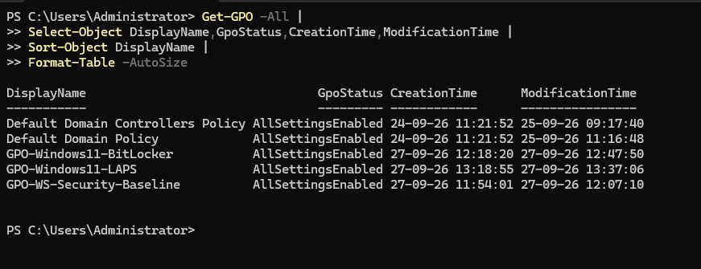
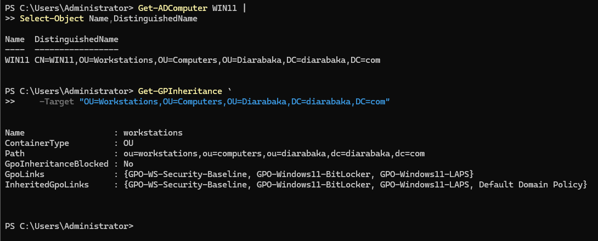
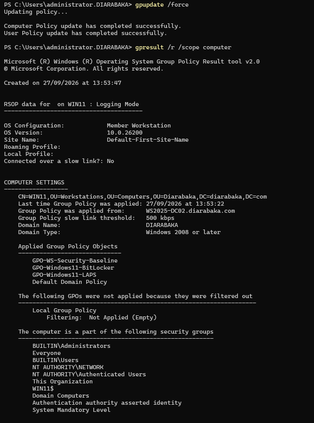
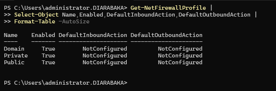
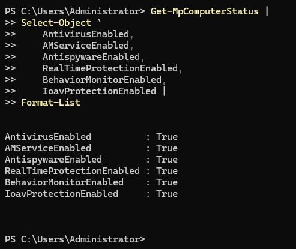
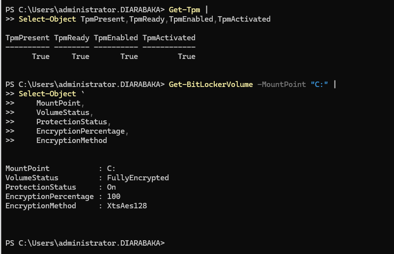
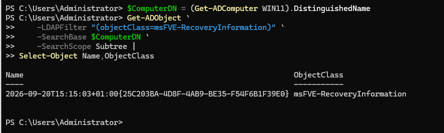
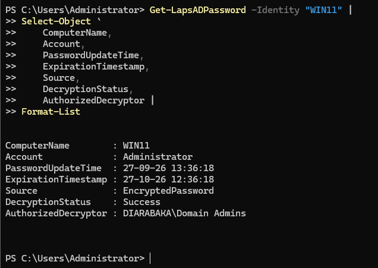
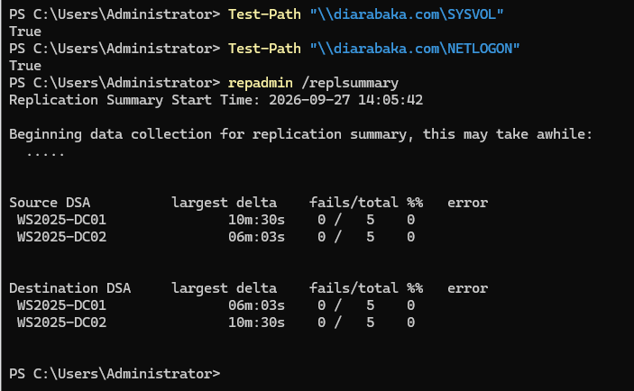
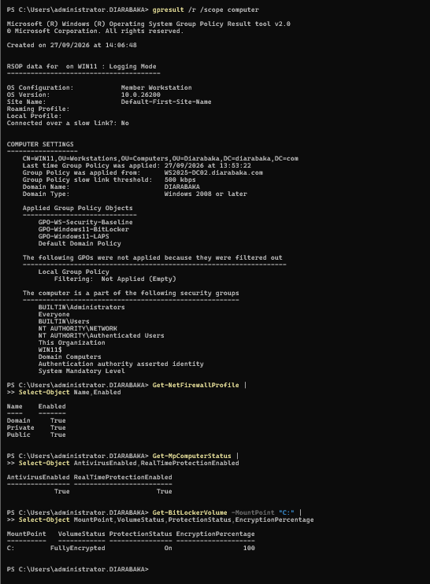

# GROUP POLICY

## Architecture

```text
DIARABAKA.COM
│
└── OU=Diarabaka
    └── Computers
        └── Workstations
            └── WIN11
                │
                ├── GPO-WS-Security-Baseline
                ├── GPO-Windows11-BitLocker
                └── GPO-Windows11-LAPS
```

---

## 01 - GPO Inventory



```text
GPO-WS-Security-Baseline
GPO-Windows11-BitLocker
GPO-Windows11-LAPS
Default Domain Policy
```

---

## 02 - OU and GPO Links



Target:

```text
CN=WIN11
OU=Workstations
OU=Computers
OU=Diarabaka
DC=diarabaka,DC=com
```

---

## 03 - Applied Group Policies



Applied:

```text
GPO-WS-Security-Baseline
GPO-Windows11-BitLocker
GPO-Windows11-LAPS
Default Domain Policy
```

---

## 04 - Windows Firewall



Validated:

```text
Domain Profile  : Enabled
Private Profile : Enabled
Public Profile  : Enabled
```

---

## 05 - Microsoft Defender



Validated:

```text
Antivirus                  : Enabled
Real-Time Protection       : Enabled
Antispyware                : Enabled
Behavior Monitoring        : Enabled
IOAV Protection            : Enabled
```

---

## 06 - BitLocker and TPM



Validated:

```text
TPM Present          : True
TPM Ready            : True
TPM Enabled          : True
TPM Activated        : True

Volume C:            : Fully Encrypted
Protection           : On
Encryption           : 100%
Encryption Method    : XTS-AES
TPM Protector        : Present
Recovery Protector   : Present
```

> BitLocker recovery password is not exposed.

---

## 07 - BitLocker Recovery in Active Directory



Validated:

```text
msFVE-RecoveryInformation
```

> Recovery information verified in Active Directory. Recovery secrets are not published.

---

## 08 - Windows LAPS



| Setting             | Value            |
| ------------------- | ---------------- |
| Backup Directory    | Active Directory |
| Password Length     | 14+              |
| Password Age        | 30 days          |
| Password Encryption | Enabled          |
| Policy Processing   | Enabled          |

```text
Windows LAPS
     ↓
WIN11
     ↓
Password Rotation
     ↓
Active Directory Backup
```

> LAPS password is redacted.

---

## 09 - SYSVOL and Active Directory Replication



Validated:

```text
SYSVOL               : Available
NETLOGON              : Available
AD Replication        : Healthy
Replication Failures  : 0
```

---

## 10 - Final Group Policy Validation



```text
GPO Application      : PASS
Security Baseline    : PASS
Windows Firewall     : PASS
Microsoft Defender   : PASS
BitLocker            : PASS
Windows LAPS         : PASS
SYSVOL               : PASS
AD Replication       : PASS
Post-Reboot          : PASS
```

---

## Validation

```text
GPO Inventory
OU / GPO Links
GPO Application
Windows Firewall
Microsoft Defender
BitLocker / TPM
BitLocker AD Recovery
Windows LAPS
SYSVOL / Replication
Post-Reboot Validation
```
