# PHASE 06 - FILE SERVER

## Architecture

```text
USERS
  ↓
GLOBAL GROUPS
  ↓
DOMAIN LOCAL GROUPS
  ↓
SMB + NTFS
  ↓
FILE01
```

Example:

```text
mmartin
   ↓
GG-HR
   ↓
DL-FS-HR-Modify
   ↓
HR$
```

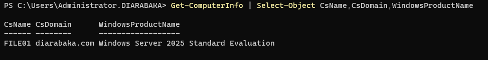

---

## Storage

```text
Shares
├── Departments
│   ├── IT
│   ├── HR
│   ├── Finance
│   ├── Marketing
│   └── Sales
└── Public
```

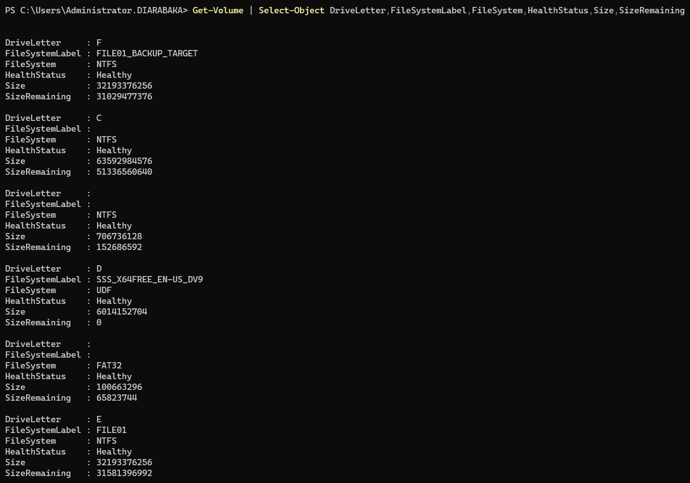

---

## AGDLP

| Global Group   | Resource Group           | Permission          |
| -------------- | ------------------------ | ------------------- |
| `GG-IT`        | `DL-FS-IT-Modify`        | `IT$` Modify        |
| `GG-HR`        | `DL-FS-HR-Modify`        | `HR$` Modify        |
| `GG-Finance`   | `DL-FS-Finance-Modify`   | `Finance$` Modify   |
| `GG-Marketing` | `DL-FS-Marketing-Modify` | `Marketing$` Modify |
| `GG-Sales`     | `DL-FS-Sales-Modify`     | `Sales$` Modify     |

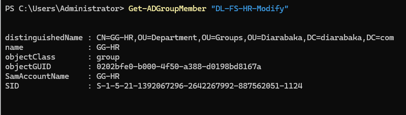

---

## SMB Shares

```text
IT$
HR$
Finance$
Marketing$
Sales$
Public$
```

```powershell
Get-SmbShare |
Where-Object Name -in @(
    'IT$','HR$','Finance$','Marketing$','Sales$','Public$'
) |
Select-Object Name,Path,FolderEnumerationMode,EncryptData
```

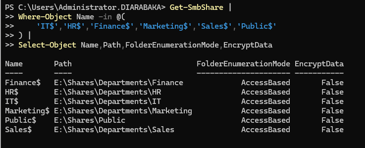

---

## SMB / NTFS ACL

```text
SMB Full
   +
NTFS Modify
   =
Effective Modify
```

```powershell
Get-SmbShareAccess -Name "HR$"

$HRPath = (Get-SmbShare -Name "HR$").Path
(Get-Acl $HRPath).Access
```

Administrative ACLs preserved:

```text
SYSTEM
BUILTIN\Administrators
```

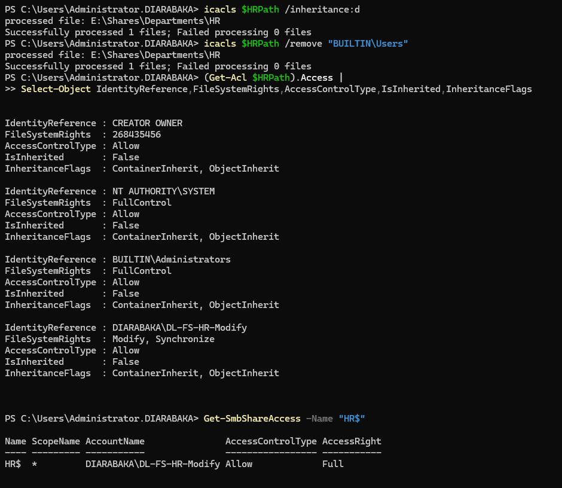

---

## Access Tests

HR user:

```text
\\FILE01\HR$
```

Result:

```text
Modify : Allowed
```

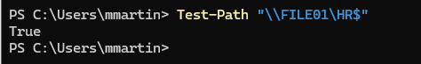

Negative test:

```powershell
Get-ChildItem "\\FILE01\Finance$" -ErrorAction Stop
```

Result:

```text
Access Denied
```

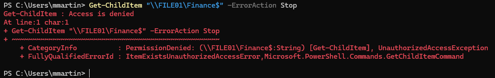

---

## SMB Security

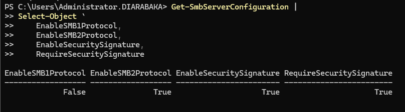

```text
SMB1            : Disabled / Not Required
SMB2/SMB3       : Enabled
ABE             : Enabled
Least Privilege : Applied
```

---

## FSRM

```text
Department Quota : 5 GB
Type             : Hard
Thresholds       : 80% / 90% / 100%
```

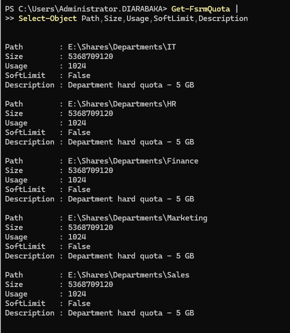

---

## Backup

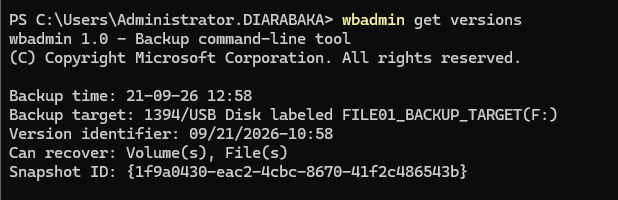

```text
Backup target:
FILE01_BACKUP_TARGET (F:)

Can recover:
Volume(s), File(s)
```

---

## Restore Validation

Restored file:

```text
C:\Restore-Test\Backup-Test.txt
```

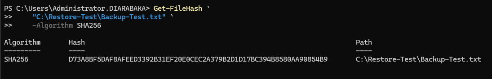

ACL validation:

```powershell
icacls "C:\Restore-Test\Backup-Test.txt"
```

Result:

```text
File restored    : PASS
SHA256           : PASS
ACL preservation : PASS
SMB validation   : PASS
```

---

## SMB / NTFS Permissions

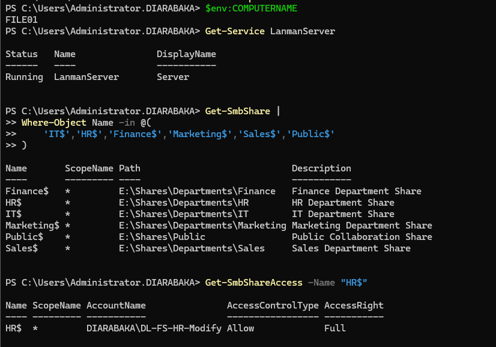

```text
LanmanServer   : Running
SMB Shares     : Available
NTFS ACL       : Preserved
FSRM           : Functional
Client Access  : Functional
Isolation      : Functional
Backup         : Available
Restore        : Validated
```

### Validation

| Control              | Status |
| -------------------- | :----: |
| FILE01               |   ✅   |
| AGDLP                |   ✅   |
| SMB Shares           |   ✅   |
| SMB / NTFS ACL       |   ✅   |
| Department Isolation |   ✅   |
| ABE                  |   ✅   |
| SMB Security         |   ✅   |
| FSRM                 |   ✅   |
| Backup               |   ✅   |
| Restore              |   ✅   |
| SHA256               |   ✅   |
| ACL Preservation     |   ✅   |

**Status:** ✅ `VALIDATED`
