# FILE SERVER

## 01 - FILE01 Baseline

```text
Server       : FILE01
Domain       : diarabaka.com
Role         : File Server
SMB Service  : Running
```

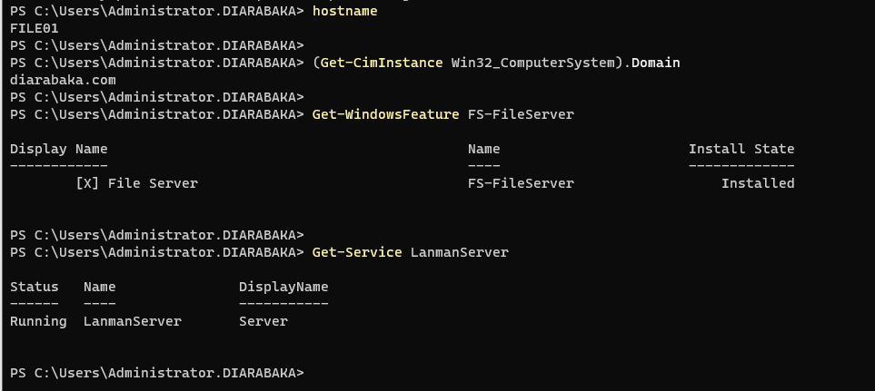

---

## 02 - Storage

```text
FILE01
│
├── System Volume
│
└── Data Volume
    └── Shares
        ├── Departments
        │   ├── IT
        │   ├── HR
        │   ├── Finance
        │   ├── Marketing
        │   └── Sales
        └── Public
```

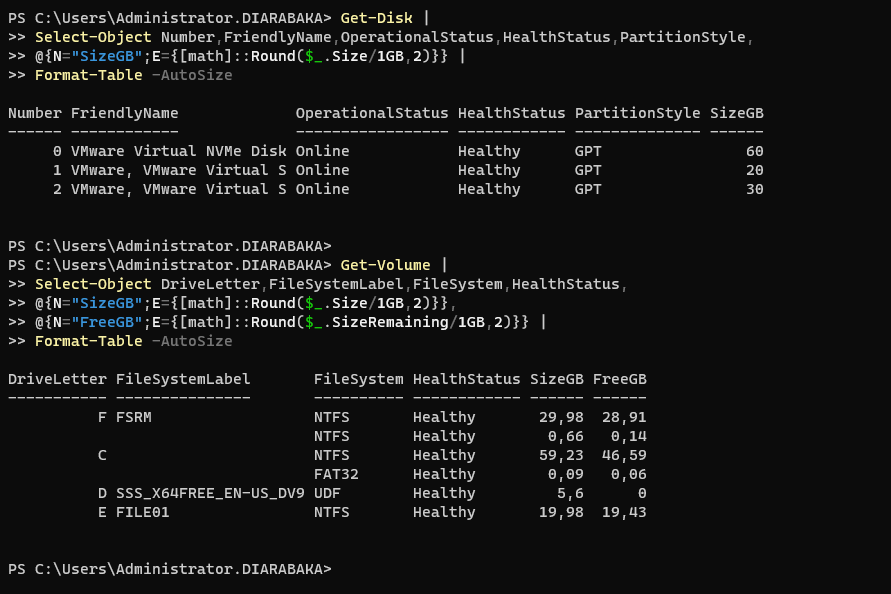

---

## 03 - AGDLP

Authorization model:

```text
USER
  ↓
GLOBAL GROUP
  ↓
DOMAIN LOCAL GROUP
  ↓
SMB / NTFS PERMISSION
```

Example:

```text
mmartin
   ↓
GG-HR
   ↓
DL-FS-HR-Modify
   ↓
HR$
```

| Global Group   | Resource Group           | Resource     |
| -------------- | ------------------------ | ------------ |
| `GG-IT`        | `DL-FS-IT-Modify`        | `IT$`        |
| `GG-HR`        | `DL-FS-HR-Modify`        | `HR$`        |
| `GG-Finance`   | `DL-FS-Finance-Modify`   | `Finance$`   |
| `GG-Marketing` | `DL-FS-Marketing-Modify` | `Marketing$` |
| `GG-Sales`     | `DL-FS-Sales-Modify`     | `Sales$`     |

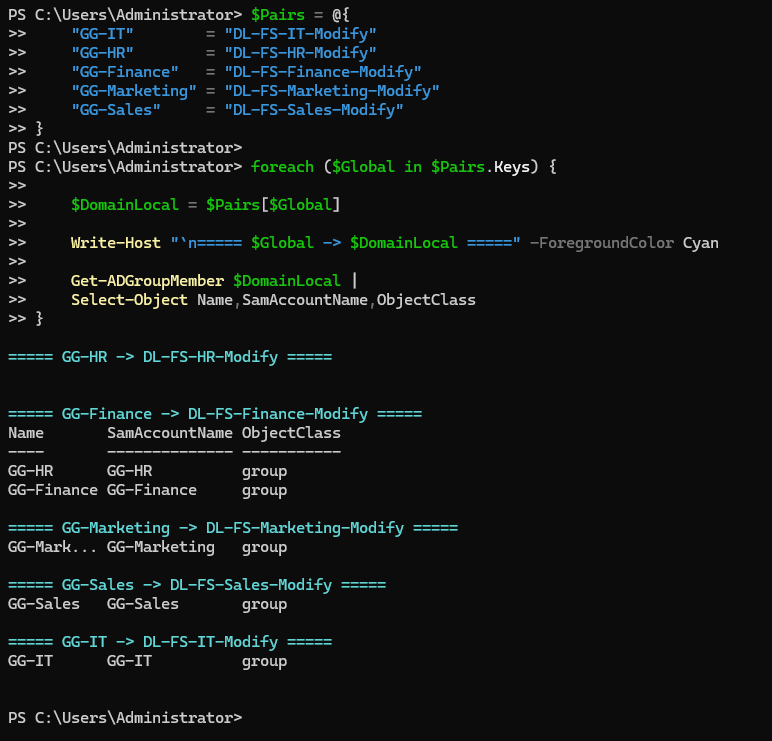

---

## 04 - SMB Shares

```text
IT$
HR$
Finance$
Marketing$
Sales$
Public$
```

Access-Based Enumeration is enabled on the departmental shares.

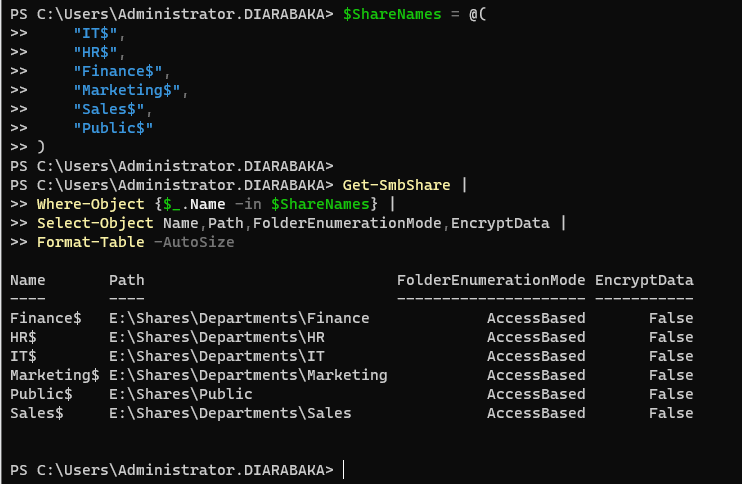

---

## 05 - SMB Permissions

Resource permissions are assigned through Domain Local groups.

```text
HR$
    ↓
DIARABAKA\DL-FS-HR-Modify

Finance$
    ↓
DIARABAKA\DL-FS-Finance-Modify

IT$
    ↓
DIARABAKA\DL-FS-IT-Modify
```

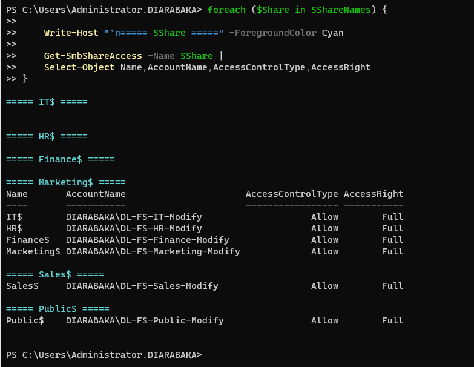

---

## 06 - NTFS Permissions

Permission model:

```text
SMB Full
   +
NTFS Modify
   =
Effective Modify
```

Administrative permissions are preserved:

```text
SYSTEM
BUILTIN\Administrators
```

Department resource groups receive NTFS `Modify` permissions.

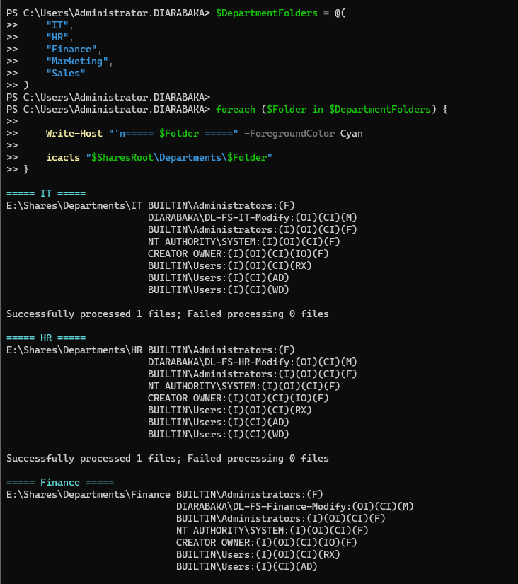

---

## 07 - Positive Access Test

A user belonging to the HR department was used to validate access to:

```text
\\FILE01\HR$
```

Validation:

```text
TCP 445       : Reachable
HR$ Access    : Allowed
File Creation : Successful
File Read     : Successful
```

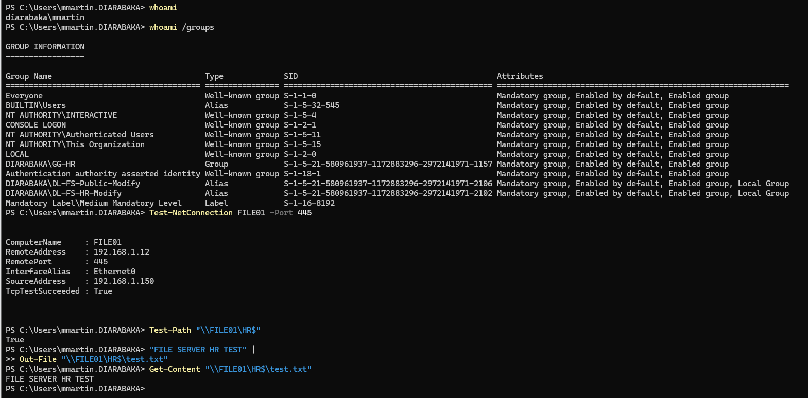

---

## 08 - Department Isolation

A negative access test was performed using the HR account against another department share.

Example:

```text
HR User
   ↓
Finance$
   ↓
ACCESS DENIED
```

This validates departmental isolation and least-privilege access.

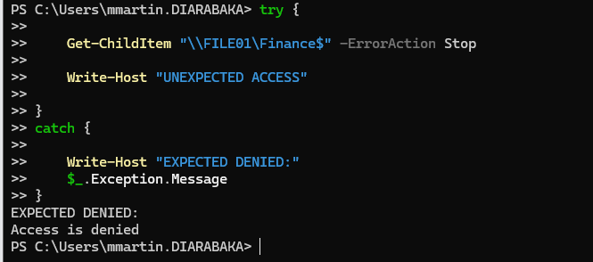

---

## 09 - FSRM Quotas

File Server Resource Manager is used to control departmental storage.

```text
Department Quota : 5 GB
Quota Type       : Hard
SoftLimit        : False
```

Threshold strategy:

```text
80%
90%
100%
```

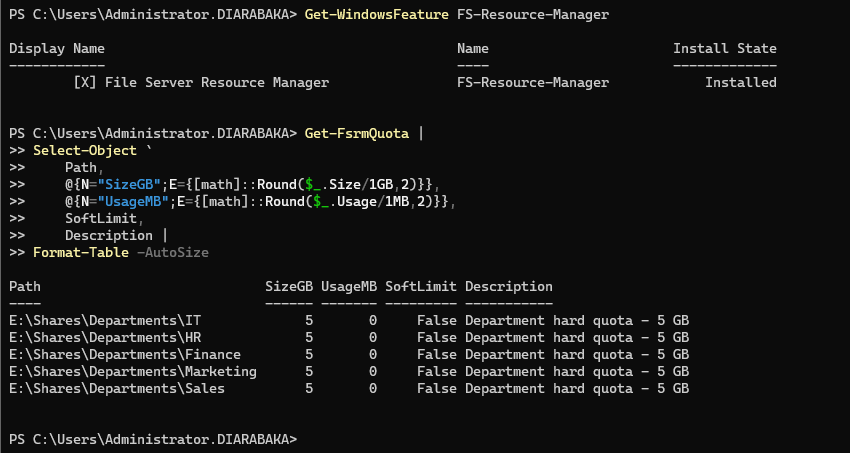

---

## 10 - Backup Validation

### Backup Version

Windows Server Backup is configured with a dedicated backup target separate from the data volume.

```text
FILE01 Data
     ↓
Separate Backup Target
     ↓
Windows Server Backup
```

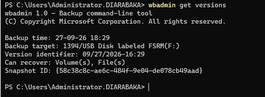

### Backup Content

The backup version and included items were verified before recovery testing.

```text
Backup Version : Present
Backup Target  : Verified
Backup Items   : Verified
```

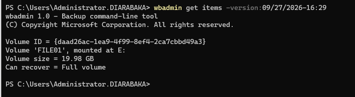

---

## 11 - Restore Validation

### SHA256 Integrity Validation

A test file was restored to an alternate location:

```text
C:\Restore-Test
```

The original and restored SHA256 hashes were compared.

```text
Original SHA256
       =
Restored SHA256
```

Result:

```text
MATCH : True
```

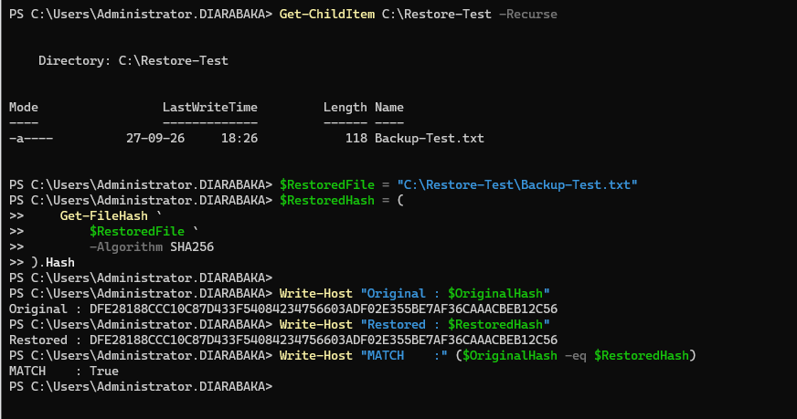

### ACL Validation

NTFS permissions on the restored file were also reviewed.

```powershell
icacls "<RESTORED_FILE>"
```

Validation:

```text
File Restored    : PASS
SHA256           : PASS
ACL Preservation : PASS
```

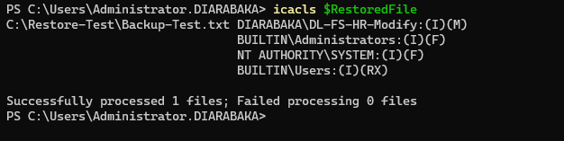

---

## 12 - Final Validation

### FILE01 Server Validation

Final server-side validation confirms:

```text
LanmanServer : Running
SMB Shares   : Available
FSRM         : Functional
Backup       : Available
```

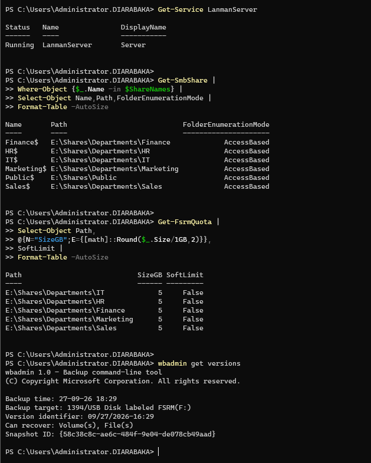

### Client Validation

Final validation from the Windows 11 client confirms:

```text
DNS Resolution    : Functional
TCP 445           : Reachable
Authorized Share  : Accessible
Public Share      : Accessible
Department Access : Isolated
```

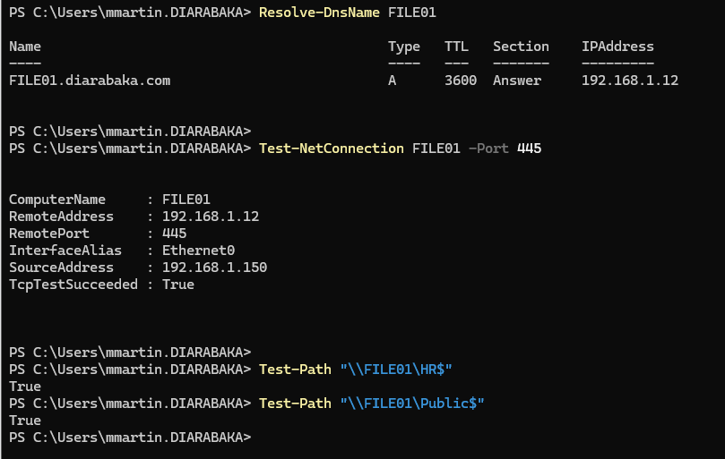

---

## Validation

```text
FILE01
Storage
AGDLP
SMB Shares
SMB Permissions
NTFS Permissions
Positive Access
Department Isolation
Access-Based Enumeration
FSRM
Backup
Backup Content
Restore
SHA256 Integrity
ACL Preservation
Final Server Validation
Final Client Validation
```
