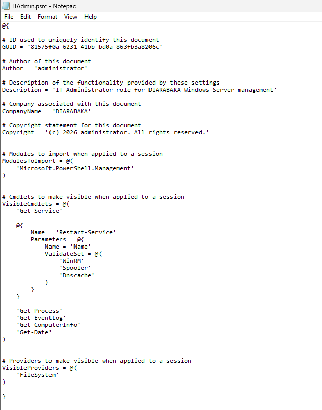
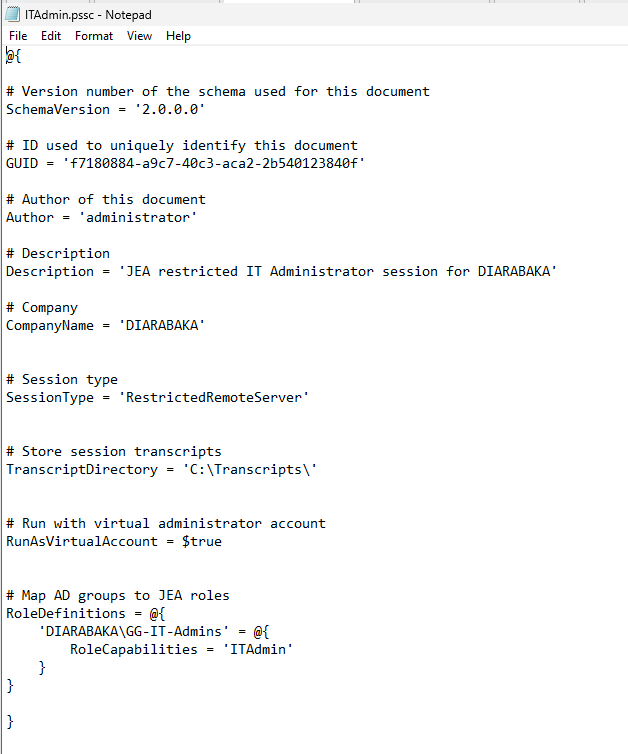
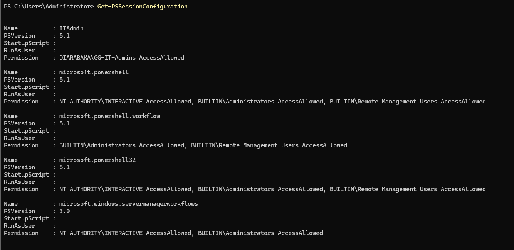
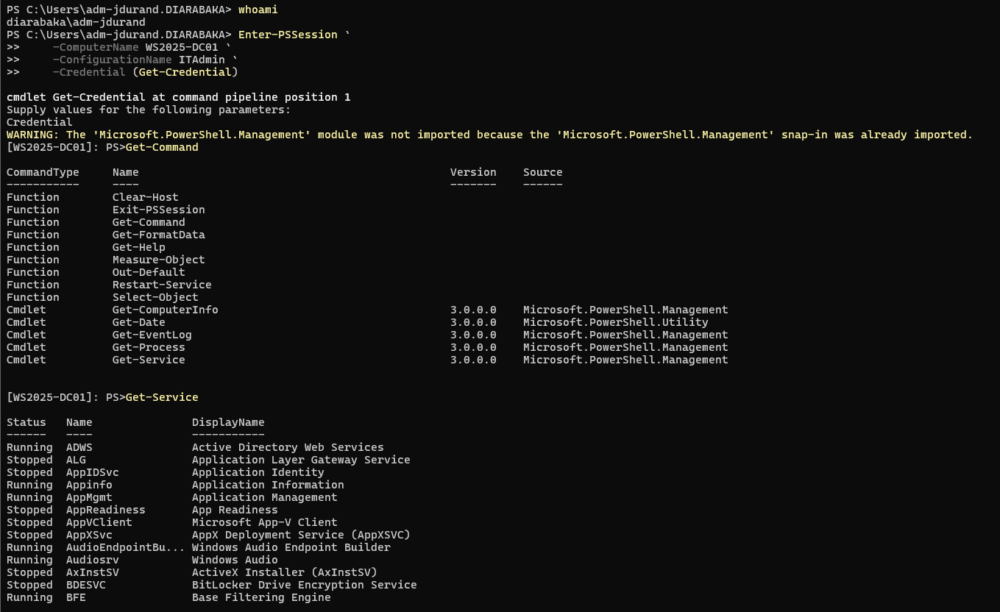

# TASK17 - Just Enough Administration (JEA)

## Overview

Implemented **Just Enough Administration (JEA)** to provide restricted administrative access to Windows Server resources using the principle of least privilege.

The configuration uses:

- JEA Role Capabilities
- Restricted PowerShell sessions
- Active Directory group-based authorization
- Virtual administrator accounts
- Session transcription
- Limited cmdlet exposure

---

## 01 - JEA Role Capability



The `ITAdmin.psrc` Role Capability defines which commands are available inside the JEA session.

Allowed commands include:

```powershell
Get-Service
Restart-Service
Get-Process
Get-EventLog
Get-ComputerInfo
Get-Date
```

`Restart-Service` is restricted to approved services:

```text
WinRM
Spooler
Dnscache
```

This prevents delegated administrators from restarting arbitrary Windows services.

---

## 02 - JEA Session Configuration



The `ITAdmin.pssc` session configuration defines the restricted JEA endpoint.

Key settings:

```powershell
SessionType = 'RestrictedRemoteServer'

TranscriptDirectory = 'C:\Transcripts\'

RunAsVirtualAccount = $true

RoleDefinitions = @{
    'DIARABAKA\GG_ITAdmins' = @{
        RoleCapabilities = 'ITAdmin'
    }
}
```

Security controls:

```text
Restricted Remote Session
Active Directory Group Authorization
Virtual Administrator Account
Session Transcription
```

---

## 03 - JEA Endpoint



The JEA endpoint is registered as:

```text
ITAdmin
```

Validation can be performed with:

```powershell
Get-PSSessionConfiguration |
Where-Object {$_.Name -eq "ITAdmin"}
```

The endpoint provides controlled remote administration without granting a full unrestricted PowerShell session.

---

## 04 - Functional Validation



A delegated administrator connects using:

```powershell
Enter-PSSession `
    -ComputerName WS2025-DC01 `
    -ConfigurationName ITAdmin `
    -Credential (Get-Credential)
```

Inside the JEA session:

```powershell
Get-Command
```

Only the authorized commands are exposed.

Example authorized operation:

```powershell
Get-Service
```

Restricted commands outside the JEA role are unavailable.

---

## Security Model

```text
AD User
   ↓
GG_ITAdmins
   ↓
JEA Endpoint
   ↓
ITAdmin Role Capability
   ↓
Restricted PowerShell Commands
   ↓
Virtual Administrator Account
   ↓
Windows Server
```

---

## Result

```text
JEA Role Capability        : Configured
JEA Session Configuration  : Configured
AD Group Authorization     : Configured
Restricted Cmdlets         : Configured
Virtual Account            : Enabled
Session Transcription      : Enabled
JEA Endpoint               : Registered
Functional Validation      : Completed
```
