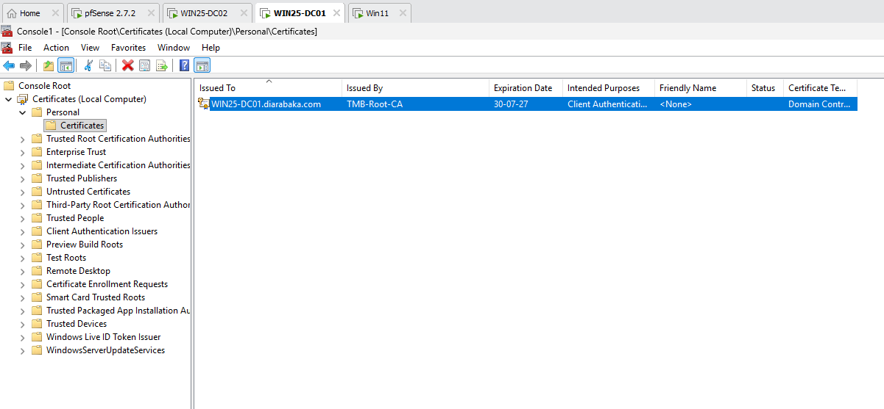
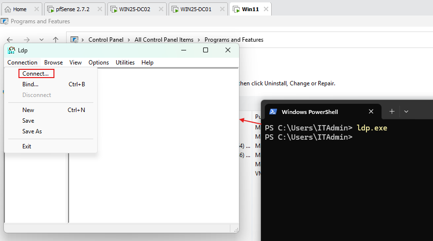
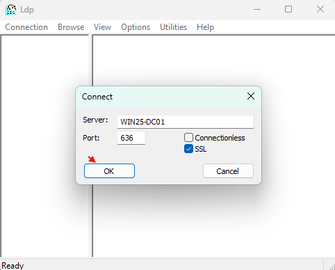
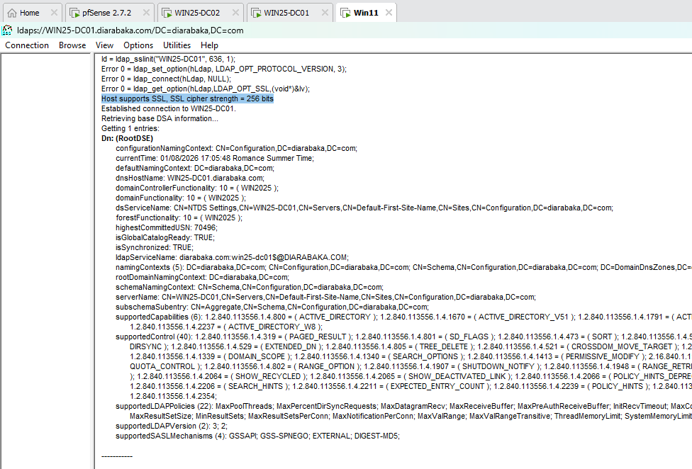
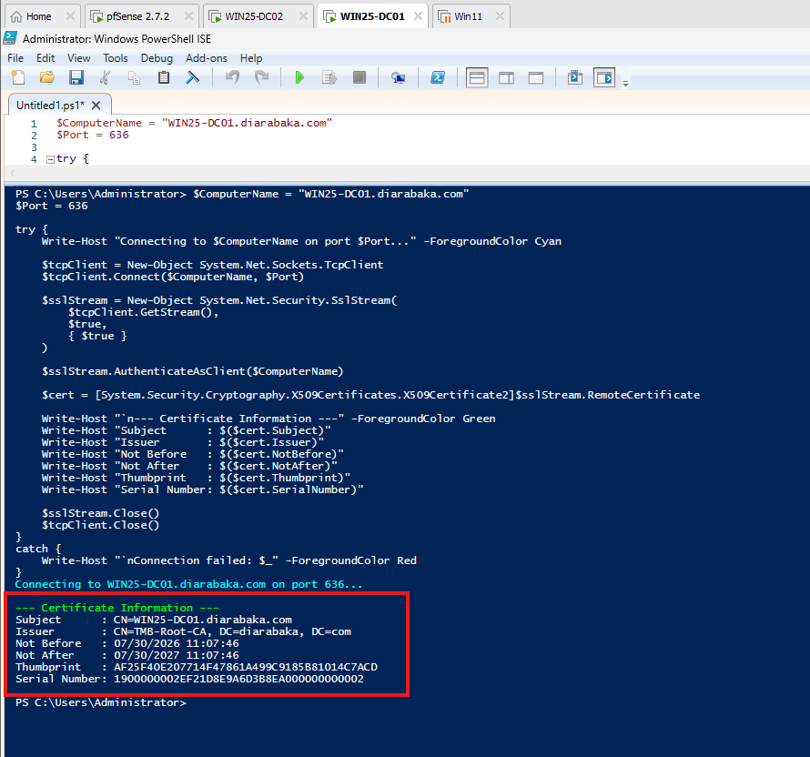
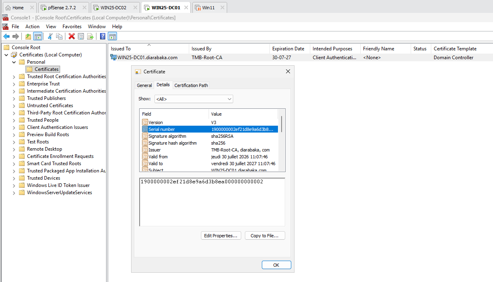
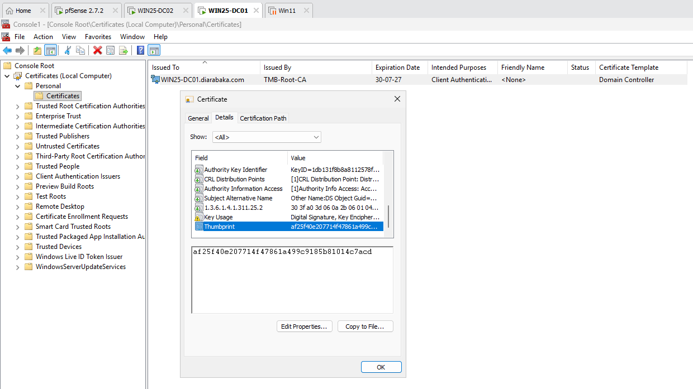

# LDAPS Configuration and Validation

## Overview

Implemented and validated **LDAPS (LDAP over SSL/TLS)** for the `diarabaka.com` Active Directory environment.

The internal **Enterprise Certificate Authority is hosted on a dedicated server**, while LDAPS is provided by the Domain Controller `WIN2025-DC01`.

LDAPS provides encrypted LDAP communication between clients and Active Directory Domain Controllers.

This validation focuses on:

- Certificate issued by the internal Enterprise CA
- Domain Controller certificate installation
- Server Authentication capability
- Certificate trust
- LDAPS over TCP 636
- Successful SSL/TLS LDAP connection

---

## 01 - Domain Controller Certificate



The certificate installed on `WIN2025-DC01` was verified using the Windows Certificates MMC console.

Path:

```text
Certificates (Local Computer)
└── Personal
    └── Certificates
```

The certificate confirms:

```text
Issued To       : WIN2025-DC01.diarabaka.com
Issued By       : Internal Enterprise CA
Private Key     : Present
Server Auth     : Enabled
Certificate     : Valid
```

The certificate was issued by the dedicated Enterprise CA and installed on the Domain Controller.

It includes the required **Server Authentication** purpose for secure LDAP communication.

---

## 02 - LDAPS Connection Validation













LDAPS connectivity was validated using:

```text
ldp.exe
```

Connection settings:

```text
Server : WIN2025-DC01.diarabaka.com
Port   : 636
SSL    : Enabled
```

A successful SSL connection confirms that the Domain Controller accepts secure LDAP communication over TCP 636.

---

## Architecture

```text
                    DIARABAKA.COM
                          │
              ┌───────────┴───────────┐
              │                       │
              ▼                       ▼
     Enterprise CA Server      WIN2025-DC01
              │                 Domain Controller
              │                       │
              │ Issue Certificate     │
              └──────────────────────►│
                                      │
                               DC Certificate
                                      │
                               Server Authentication
                                      │
                                    TLS
                                      │
                                  LDAPS : 636
                                      │
                                      ▼
                               Windows Clients
```

---

## Certificate Flow

```text
Enterprise CA Server
        ↓
Certificate Issued
        ↓
WIN2025-DC01
        ↓
Local Computer Certificate Store
        ↓
Server Authentication
        ↓
TLS
        ↓
LDAPS TCP 636
```

---

## LDAPS Communication Flow

```text
Windows Client
      │
      │ LDAP over SSL/TLS
      │ TCP 636
      ▼
WIN2025-DC01
      │
      ├── Active Directory Domain Services
      ├── Domain Controller Certificate
      ├── Private Key
      └── Server Authentication
      │
      ▼
Active Directory
diarabaka.com
```

---

## Validation

```text
Enterprise CA                : Separate Server
Domain Controller            : WIN2025-DC01
Domain Controller Certificate: Present
Certificate Issuer           : Internal Enterprise CA
Certificate Validity         : Valid
Private Key                  : Present
Server Authentication        : Enabled
LDAPS Port                    : 636
SSL/TLS Connection           : Successful
LDAPS                        : VALIDATED
```

---

## Result

```text
ENTERPRISE CA               : OPERATIONAL
DC CERTIFICATE              : VALIDATED
SERVER AUTHENTICATION       : VALIDATED
PRIVATE KEY                 : PRESENT
TLS                         : VALIDATED
LDAPS TCP 636               : VALIDATED
LDAP SSL CONNECTION         : SUCCESSFUL
```

---

**Technology:** LDAPS / Active Directory Domain Services  
**Domain:** `diarabaka.com`  
**Domain Controller:** `WIN2025-DC01`  
**Certificate Authority:** Dedicated Enterprise CA Server  
**Protocol:** LDAP over SSL/TLS  
**Port:** `636`
